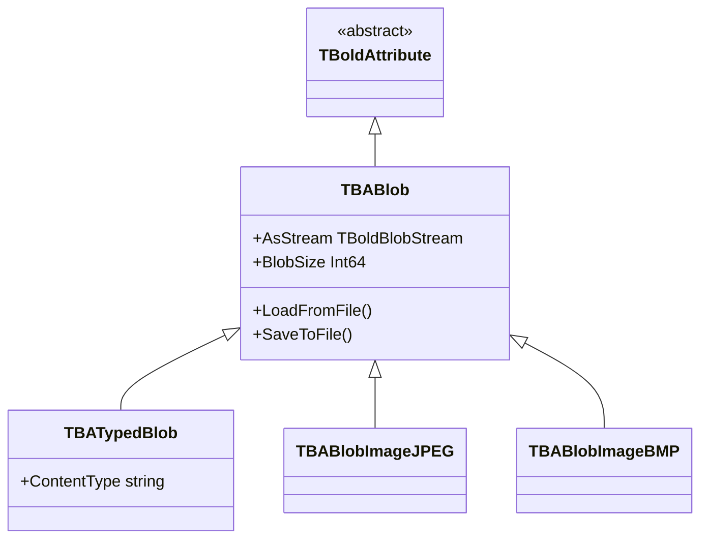

# TBABlob

`TBABlob` stores binary large object data using `TBoldBlobStream`. Suitable for files, images, documents, and any binary content.

## Class Hierarchy



## Class Definition

```pascal
TBABlob = class(TBoldAttribute)
public
  destructor Destroy; override;
  procedure SetToNull; override;
  procedure Assign(Source: TBoldElement); override;
  procedure SetEmptyValue; override;
  procedure LoadFromStream(Stream: TStream);
  procedure LoadFromFile(const aFileName: string; aMode: Word = fmShareDenyNone);
  procedure SaveToStream(Stream: TStream);
  procedure SaveToFile(const FileName: string);
  function CompareToAs(CompareType: TBoldCompareType; BoldElement: TBoldElement): Integer; override;
  property AsStream: TBoldBlobStream read GetAsStream;
  property BlobSize: Int64 read GetBlobSize;
  property ContentType: string; // via StringRepresentation
end;

TBATypedBlob = class(TBABlob)
public
  // Adds explicit ContentType property
  function CanSetContentType(Value: string; Subscriber: TBoldSubscriber): Boolean;
end;
```

## TBoldBlobStream

The blob's data is accessed through `TBoldBlobStream`, which extends `TStream`:

```pascal
TBoldBlobStream = class(TStream)
public
  procedure Clear;
  procedure Truncate;
  procedure LoadFromStream(Stream: TStream);
  procedure LoadFromFile(const aFileName: string);
  procedure SaveToStream(Stream: TStream);
  procedure SaveToFile(const FileName: string);
  function IsDataSame(AData: Pointer; ASize: Int64): Boolean;
end;
```

## Working with TBABlob

### Loading and Saving Files

```pascal
// Load a file into a blob attribute
Document.M_Attachment.LoadFromFile('C:\Reports\annual.pdf');

// Save blob to file
Document.M_Attachment.SaveToFile('C:\Temp\export.pdf');
```

### Working with Streams

```pascal
// Load from stream
var MemStream: TMemoryStream;
MemStream := TMemoryStream.Create;
try
  MemStream.LoadFromFile('image.jpg');
  Product.M_Photo.LoadFromStream(MemStream);
finally
  MemStream.Free;
end;

// Read via stream
Product.M_Photo.AsStream.SaveToFile('output.jpg');
```

### Checking Size and Content

```pascal
// Check if blob has data
if Product.M_Photo.IsNull then
  ShowMessage('No photo');

// Check size
ShowMessage(Format('Size: %d bytes', [Product.M_Photo.BlobSize]));
```

### Typed Blobs

`TBATypedBlob` adds a MIME-type content type:

```pascal
// Set content type for a typed blob
Document.M_Attachment.ContentType := 'application/pdf';
```

## Blob Subtypes

| Type | Purpose | Content Type |
|------|---------|-------------|
| `TBABlob` | Generic binary data | None |
| `TBATypedBlob` | Binary with MIME type | User-defined |
| `TBABlobImageJPEG` | JPEG images | image/jpeg |
| `TBABlobImageBMP` | BMP images | image/bmp |

## See Also

- [TBoldAttribute](TBoldAttribute.md) - Base class
- [TBAString](TBAString.md) - For text data, use string attributes
