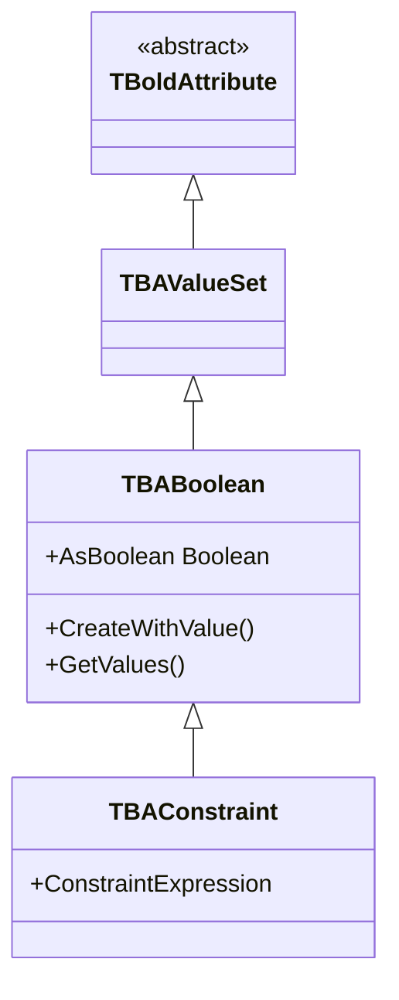

# TBABoolean

`TBABoolean` stores boolean attribute values. Unusually, it inherits from `TBAValueSet` (the enumeration base class) rather than directly from `TBoldAttribute`, because a boolean is modeled as a two-value set.

## Class Hierarchy



## Class Definition

```pascal
TBAValueSet = class(TBoldAttribute)
public
  class function GetValues: TBAValueSetValueList; virtual; abstract;
  function GetContentAsInteger: Integer; virtual;
  procedure SetContentAsInteger(NewValue: Integer); virtual;
end;

TBABoolean = class(TBAValueSet)
public
  constructor CreateWithValue(Value: Boolean);
  class function GetValues: TBAValueSetValueList; override;
  property AsBoolean: Boolean read GetAsBoolean write SetAsBoolean;
end;
```

## Working with TBABoolean

### Reading and Writing

```pascal
// Direct property access
IsActive := Customer.Active;
Customer.Active := True;

// Raw member access
Customer.M_Active.AsBoolean := False;
```

### Null Handling (Three-State)

Boolean attributes can be null (unknown/unset):

```pascal
// Check for null
if Customer.M_Active.IsNull then
  ShowMessage('Active status unknown');

// Set to null (unknown)
Customer.M_Active.SetToNull;
```

### TBAConstraint

`TBAConstraint` is a special derived boolean that evaluates an OCL constraint expression:

```pascal
// Constraints are defined in the UML model
// They automatically evaluate and return True/False
if not Order.M_IsValid.AsBoolean then
  ShowMessage('Order constraint violated: ' + Order.M_IsValid.AsString);
```

## Common Patterns

### Binding to TBoldCheckBox

```pascal
// In form designer:
// BoldCheckBox1.BoldHandle := ExpressionHandle pointing to boolean attr
// AllowGrayed := True for nullable booleans
```

### OCL Boolean Operations

```
// Filter by boolean attribute
Customer.allInstances->select(active = true)
Customer.allInstances->reject(active)

// Boolean logic
self.active and self.verified
self.active or self.verified
not self.active
```

## See Also

- [TBoldAttribute](TBoldAttribute.md) - Grandparent class
- [TBoldCheckBox](TBoldCheckBox.md) - UI component for boolean display
- [TBAString](TBAString.md) - String attribute sibling
