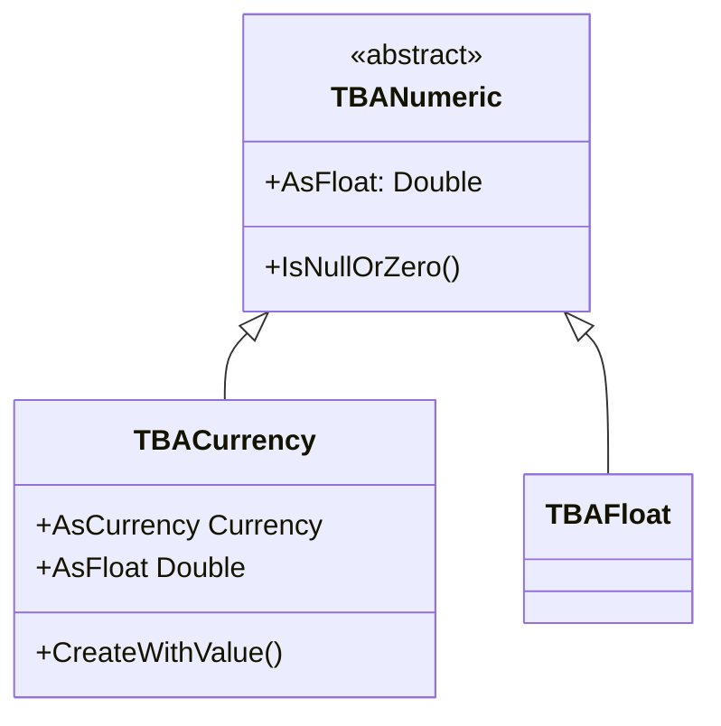

# TBACurrency

`TBACurrency` stores Delphi's `Currency` type — a 64-bit fixed-point value with 4 decimal places. Ideal for financial calculations where floating-point rounding errors are unacceptable.

## Class Hierarchy



## Class Definition

```pascal
TBACurrency = class(TBANumeric)
public
  constructor CreateWithValue(Value: Currency);
  function ValidateString(const Value: string; Representation: TBoldRepresentation): Boolean; override;
  function ValidateCharacter(C: Char; Representation: TBoldRepresentation): Boolean; override;
  procedure SetEmptyValue; override;
  procedure Assign(Source: TBoldElement); override;
  function CompareToAs(CompType: TBoldCompareType; BoldElement: TBoldElement): Integer; override;
  function CanSetValue(NewValue: Currency; Subscriber: TBoldSubscriber): Boolean;
  property AsCurrency: Currency read GetAsCurrency write SetAsCurrency;
  property AsFloat: Double read GetAsFloat write SetAsFloat;
  property AsInteger: Integer write SetAsInteger;
end;
```

## Currency vs Float

| Feature | TBACurrency | TBAFloat |
|---------|-------------|----------|
| Delphi type | `Currency` (Int64 / 10000) | `Double` (IEEE 754) |
| Precision | Exact to 4 decimal places | ~15 significant digits |
| Range | ±922,337,203,685,477.5807 | ±1.7 × 10³⁰⁸ |
| Best for | Money, invoices, accounting | Science, measurements |
| Rounding | No rounding errors | Subject to IEEE rounding |

## Working with TBACurrency

### Reading and Writing

```pascal
// Direct property access
Total := Invoice.TotalAmount;
Invoice.TotalAmount := 1500.50;

// Raw member access
Invoice.M_TotalAmount.AsCurrency := 1500.50;

// Also accessible as Double
Invoice.M_TotalAmount.AsFloat := 1500.50;
```

### Financial Calculations

```pascal
// Currency arithmetic is exact
var Tax: Currency;
Tax := Invoice.TotalAmount * 0.25;  // exact to 4 decimals
Invoice.TaxAmount := Tax;
```

## See Also

- [TBAFloat](TBAFloat.md) - Floating-point alternative
- [TBAInteger](TBAInteger.md) - Integer sibling
- [TBoldAttribute](TBoldAttribute.md) - Base class
