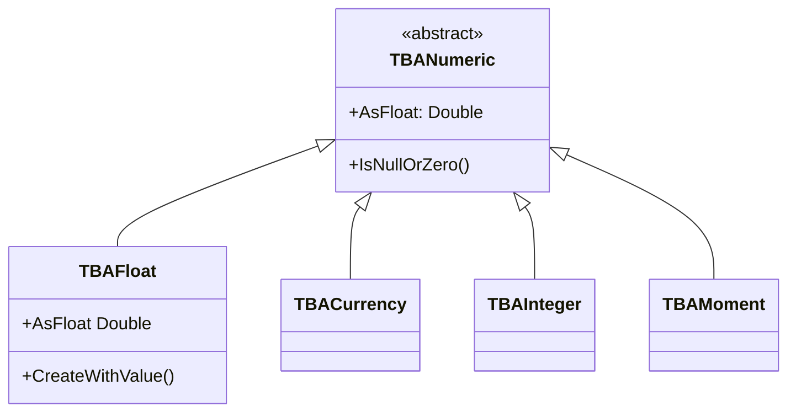

# TBAFloat

`TBAFloat` stores `Double` (64-bit IEEE floating-point) attribute values. Used for general numeric data where exact decimal precision is not critical.

## Class Hierarchy



## Class Definition

```pascal
TBAFloat = class(TBANumeric)
public
  constructor CreateWithValue(Value: Double);
  function ValidateString(const Value: string; Representation: TBoldRepresentation): Boolean; override;
  function ValidateCharacter(C: Char; Representation: TBoldRepresentation): Boolean; override;
  procedure SetEmptyValue; override;
  procedure Assign(Source: TBoldElement); override;
  function CompareToAs(CompType: TBoldCompareType; BoldElement: TBoldElement): Integer; override;
  function CanSetValue(NewValue: Double; Subscriber: TBoldSubscriber): Boolean;
  property AsFloat: Double read GetAsFloat write SetAsFloat;
  property AsInteger: Integer write SetAsInteger;
end;
```

## Working with TBAFloat

### Reading and Writing

```pascal
// Direct property access
Price := Product.UnitPrice;
Product.UnitPrice := 29.99;

// Raw member access
Product.M_UnitPrice.AsFloat := 29.99;
```

### Null and Zero Checking

```pascal
if Product.M_UnitPrice.IsNull then
  ShowMessage('Price not set');

if Product.M_UnitPrice.IsNullOrZero then
  ShowMessage('No price');
```

### OCL Operations

The OCL engine supports several operations on float values:

```
self.unitPrice.formatFloat('#,##0.00')   // Format for display
self.unitPrice.simpleRound               // Round to integer (returns float!)
self.unitPrice.simpleRoundTo(2)          // Round to N decimals (returns float!)
self.safediv(self.total, self.quantity)   // Safe division (zero → INF, not 0)
```

!!! warning "Locale Sensitivity"
    `StrToFloat` is locale-sensitive. In tests, use `FloatToStr()` to generate portable string values rather than hardcoding decimal separators.

## Common Patterns

### Formatting for Display

```pascal
function FormatPrice(Attr: TBAFloat): string;
begin
  if Attr.IsNull then
    Result := '-'
  else
    Result := FormatFloat('#,##0.00', Attr.AsFloat);
end;
```

### DUnitX Type Matching

```pascal
// Assert.AreEqual requires exact types — use Double() cast
Assert.AreEqual(Double(29.99), Product.M_UnitPrice.AsFloat);
```

## See Also

- [TBACurrency](TBACurrency.md) - Fixed-point alternative for financial data
- [TBAInteger](TBAInteger.md) - Integer sibling
- [TBoldAttribute](TBoldAttribute.md) - Base class
