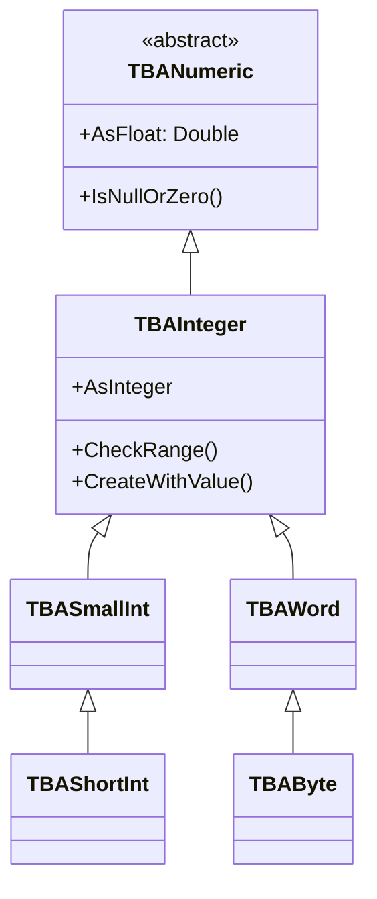

# TBAInteger

`TBAInteger` stores integer attribute values and serves as the base class for range-checked integer subtypes (`TBASmallInt`, `TBAWord`, `TBAByte`, `TBAShortInt`).

## Class Hierarchy



## Integer Subtypes

| Type | Delphi Type | Range | Typical UML Mapping |
|------|-------------|-------|---------------------|
| `TBAInteger` | `Integer` | -2,147,483,648 to 2,147,483,647 | Integer |
| `TBASmallInt` | `SmallInt` | -32,768 to 32,767 | SmallInt |
| `TBAShortInt` | `ShortInt` | -128 to 127 | ShortInt |
| `TBAWord` | `Word` | 0 to 65,535 | Word |
| `TBAByte` | `Byte` | 0 to 255 | Byte |

## Class Definition

```pascal
TBANumeric = class(TBoldAttribute)
public
  procedure SetEmptyValue; override;
  function IsNullOrZero: Boolean; virtual;
  function CompareToAs(CompType: TBoldCompareType; BoldElement: TBoldElement): Integer; override;
  property AsFloat: Double read GetAsFloat;
  property AsInteger: Integer write SetAsInteger;
end;

TBAInteger = class(TBANumeric)
public
  constructor CreateWithValue(Value: Integer);
  function CheckRange(Value: Integer): Boolean; virtual;
  function CanSetValue(Value: Integer; Subscriber: TBoldSubscriber): Boolean;
  property AsInteger: Integer read GetAsInteger write SetAsInteger;
end;
```

## Working with TBAInteger

### Reading and Writing

```pascal
// Direct property access
Age := Person.Age;
Person.Age := 30;

// Raw member access
Person.M_Age.AsInteger := 30;
```

### Null and Zero Checking

```pascal
// Check for null
if Person.M_Age.IsNull then
  ShowMessage('Age not set');

// Check for null or zero
if Person.M_Age.IsNullOrZero then
  ShowMessage('No meaningful age');
```

### Range Checking

Subtypes automatically validate ranges:

```pascal
// TBAByte.CheckRange returns False for values outside 0..255
// This is enforced when setting values
SmallIntAttr.AsSmallInt := 40000;  // raises exception: out of range
```

## Common Patterns

### Type Casting in DUnitX Tests

```pascal
// Assert.AreEqual requires exact type matching
// Cast explicitly when comparing integer types
Assert.AreEqual(Integer(30), Person.M_Age.AsInteger);
```

### Using AsFloat for Mixed Arithmetic

```pascal
// TBANumeric.AsFloat provides read-only Double access
// Useful when mixing integer and float attributes
var Total: Double;
Total := Order.M_Quantity.AsFloat * Order.M_UnitPrice.AsFloat;
```

## See Also

- [TBoldAttribute](TBoldAttribute.md) - Base class
- [TBAFloat](TBAFloat.md) - Floating-point sibling
- [TBACurrency](TBACurrency.md) - Fixed-point sibling
