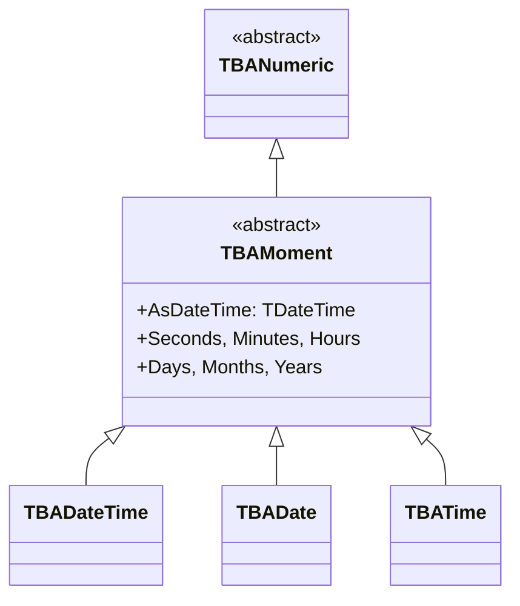

# TBAMoment

`TBAMoment` is the abstract base class for all date/time attributes in Bold. It provides the shared functionality for `TBADateTime`, `TBADate`, and `TBATime`.

## Class Hierarchy



## Date/Time Subtypes

| Type | Stores | UML Type | DB Column |
|------|--------|----------|-----------|
| `TBADateTime` | Date + Time | DateTime / MomentType | DATETIME |
| `TBADate` | Date only | Date | DATE |
| `TBATime` | Time only | Time | TIME |

## Class Definition

```pascal
TBAMoment = class(TBANumeric)
public
  function CanSetValue(NewValue: TDateTime; Subscriber: TBoldSubscriber): Boolean;
  function CompareToAs(CompType: TBoldCompareType; BoldElement: TBoldElement): Integer; override;
  function IsNullOrZero: Boolean; override;
  procedure SetEmptyValue; override;
  property AsDateTime: TDateTime read GetAsDateTime write SetAsDateTime;
end;

TBADateTime = class(TBAMoment)
public
  constructor CreateWithValue(Value: TDateTime);
  property AsDateTime;
  property AsDate: TDateTime;
  property AsTime: TDateTime;
  property Seconds: Word;
  property Minutes: Word;
  property Hours: Word;
  property Days: Word;
  property Months: Word;
  property Years: Word;
end;
```

## Working with TBAMoment

### Reading and Writing

```pascal
// Direct property access
HireDate := Employee.HireDate;
Employee.HireDate := Now;
Employee.HireDate := EncodeDate(2025, 6, 15);

// Date-only attribute
Employee.BirthDate := Date;  // today's date, no time
```

### Date Part Access

```pascal
// Access individual date/time components
var Y, M, D: Word;
Y := Employee.M_HireDate.Years;
M := Employee.M_HireDate.Months;
D := Employee.M_HireDate.Days;
```

### Null Checking

```pascal
if Employee.M_HireDate.IsNull then
  ShowMessage('Hire date not set');

// IsNullOrZero checks for both null and TDateTime(0) = Dec 30, 1899
if Employee.M_HireDate.IsNullOrZero then
  ShowMessage('No meaningful date');
```

## OCL Date Operations

!!! warning "Important: OCL date operations work on MomentType (DateTime), NOT on Date type"
    If your UML model uses `Date` type, OCL operations like `day`, `month`, `year` will fail with "Attributes can not have members". Use `DateTime` / `MomentType` instead.

| OCL Operation | Returns | Example |
|---------------|---------|---------|
| `day` | Integer (1-31) | `self.hireDate.day` |
| `month` | Integer (1-12) | `self.hireDate.month` |
| `year` | Integer | `self.hireDate.year` |
| `week` | Integer (1-53) | `self.hireDate.week` |
| `dayOfWeek` | Integer (1-7, ISO) | `self.hireDate.dayOfWeek` |

!!! note "dayOfWeek uses ISO convention"
    `dayOfWeek` returns 1=Monday through 7=Sunday (ISO 8601 via `DecodeDateWeek`). This differs from Delphi's `SysUtils.DayOfWeek` which returns 1=Sunday.

## Common Patterns

### Date Formatting

```pascal
function FormatHireDate(Attr: TBAMoment): string;
begin
  if Attr.IsNull then
    Result := 'N/A'
  else
    Result := FormatDateTime('yyyy-mm-dd', Attr.AsDateTime);
end;
```

### Date Comparison in OCL

```
// Find employees hired this year
Employee.allInstances->select(hireDate.year = 2025)

// Find employees hired on a Monday
Employee.allInstances->select(hireDate.dayOfWeek = 1)
```

## See Also

- [TBoldAttribute](TBoldAttribute.md) - Base class
- [TBAInteger](TBAInteger.md) - Numeric sibling
- [OCL Queries](../concepts/ocl.md) - OCL date operations
