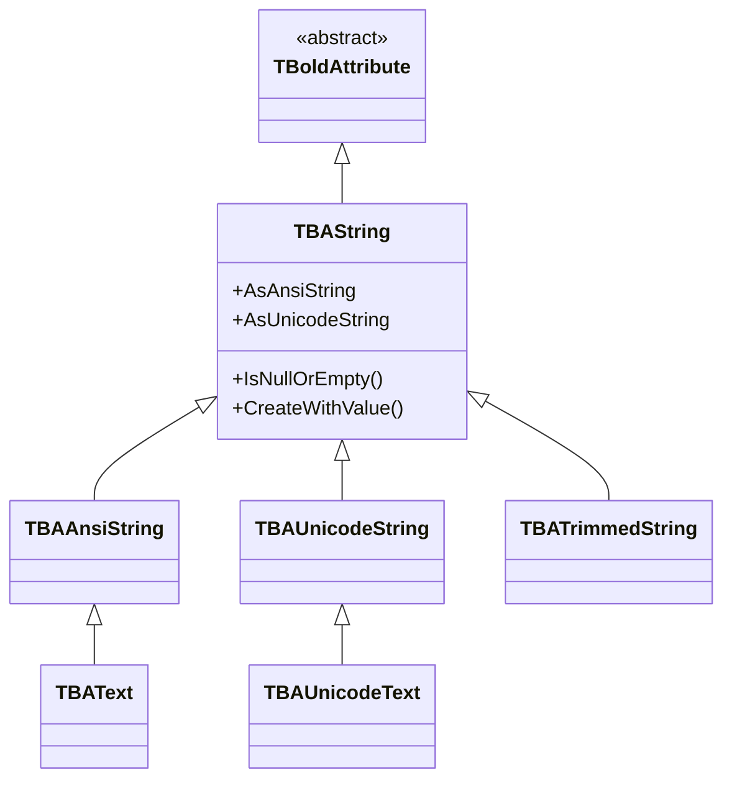

# TBAString

`TBAString` is the base class for all string attributes in Bold. It stores Unicode strings (since Delphi 2009+) and provides validation, comparison, and null handling.

## Class Hierarchy



## Class Definition

```pascal
TBAString = class(TBoldAttribute)
public
  constructor CreateWithValue(const Value: string);
  procedure Assign(Source: TBoldElement); override;
  function CompareToAs(CompType: TBoldCompareType; BoldElement: TBoldElement): Integer; override;
  function ValidateString(const Value: string; Representation: TBoldRepresentation): Boolean; override;
  function CanSetValue(NewValue: string; Subscriber: TBoldSubscriber): Boolean;
  procedure SetEmptyValue; override;
  function IsNullOrEmpty: Boolean;
  function IsEqualToValue(const Value: IBoldValue): Boolean; override;
  property AsAnsiString: TBoldAnsiString;
  property AsUnicodeString: TBoldUnicodeString;
end;
```

## String Type Variants

| Bold Type | Purpose | Max Length |
|-----------|---------|-----------|
| `TBAString` | Default Unicode string | Column length |
| `TBAAnsiString` | Legacy ANSI string | Column length |
| `TBAUnicodeString` | Explicit Unicode string | Column length |
| `TBATrimmedString` | Auto-trims whitespace on set | Column length |
| `TBAText` | Unlimited ANSI text (CLOB) | Unlimited |
| `TBAUnicodeText` | Unlimited Unicode text (NCLOB) | Unlimited |

## Working with TBAString

### Reading and Writing

```pascal
// Direct property access (generated code)
CustomerName := Customer.Name;
Customer.Name := 'Acme Corp';

// Raw member access via M_ prefix
Customer.M_Name.AsString;  // read
```

### Null and Empty Checking

```pascal
// Check for null (no value assigned)
if Customer.M_Name.IsNull then
  ShowMessage('Name not set');

// Check for null OR empty string
if Customer.M_Name.IsNullOrEmpty then
  ShowMessage('Name is missing or blank');

// Set to null
Customer.M_Name.SetToNull;

// Set to empty string (not null)
Customer.M_Name.SetEmptyValue;
```

### Validation

```pascal
// Check if a value can be set (respects constraints)
if Customer.M_Name.CanSetValue('New Name', nil) then
  Customer.Name := 'New Name';

// ValidateString checks format against the attribute's rules
if Customer.M_Name.ValidateString('test@email.com', brDefault) then
  // Valid format
```

## Common Patterns

### Safe String Access

```pascal
function GetDisplayName(Customer: TCustomer): string;
begin
  if Customer.M_Name.IsNullOrEmpty then
    Result := '(unnamed)'
  else
    Result := Customer.Name;
end;
```

### Trimmed Strings

`TBATrimmedString` automatically removes leading/trailing whitespace when a value is set. This is useful for name fields where accidental spaces are common.

## See Also

- [TBoldAttribute](TBoldAttribute.md) - Base class
- [TBoldMember](TBoldMember.md) - Member base class
- [TBABlob](TBABlob.md) - For large text, consider blob storage
