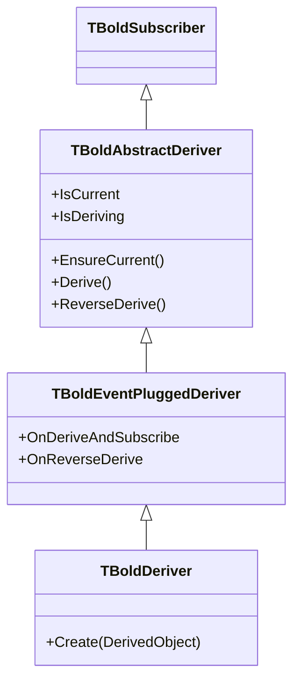
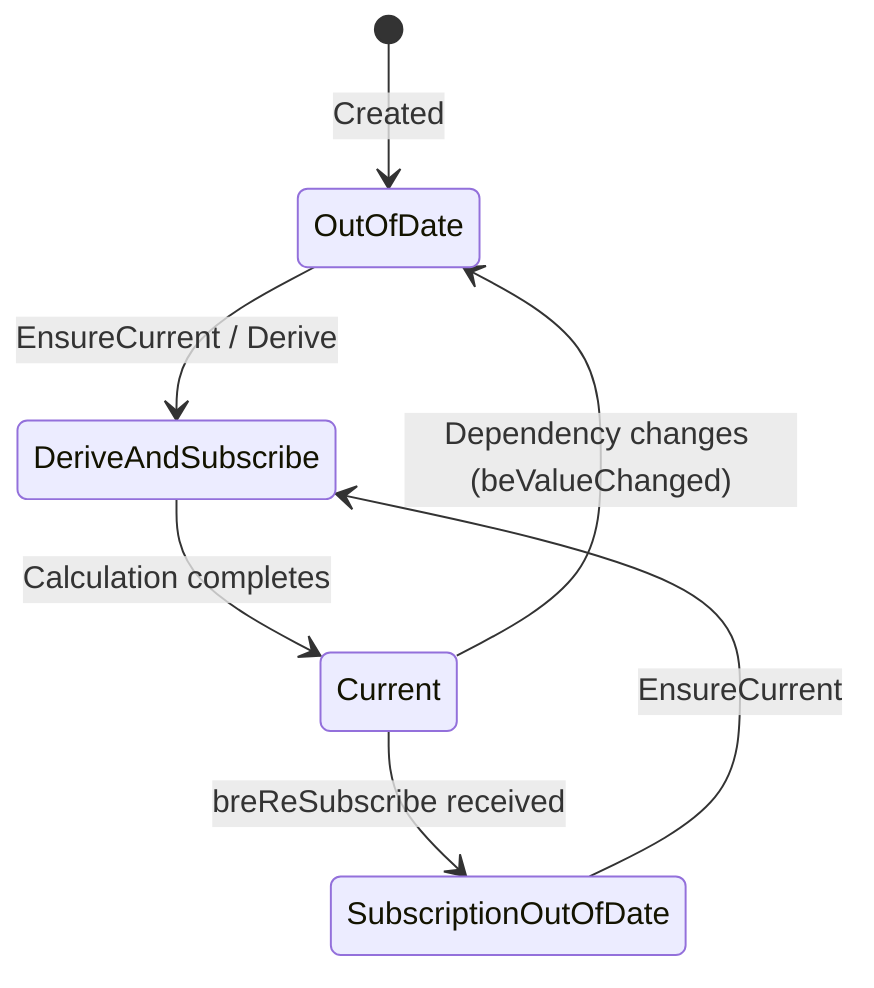

# TBoldAbstractDeriver

`TBoldAbstractDeriver` is the engine behind Bold's derived (calculated) attributes. It extends `TBoldSubscriber` with state management for lazy evaluation: values are recalculated only when dependencies change and the value is accessed.

## Class Hierarchy



## Class Definition

```pascal
TBoldDeriverState = (
  bdsCurrent,                      // Value is up to date
  bdsOutOfDate,                    // Needs recalculation
  bdsSubscriptionOutOfDate,        // Subscriptions need refresh
  bdsDeriving,                     // Currently calculating
  bdsDerivingAndSubscribing,       // Calculating + resubscribing
  bdsReverseDeriving,              // Pushing changes back
  bdsReverseDerivingSubscriptionOutOfDate
);

TBoldAbstractDeriver = class(TBoldSubscriber)
public
  procedure EnsureCurrent;       // Derive if out of date
  procedure Derive;              // Force recalculation
  procedure ReverseDerive;       // Push changes back to sources
  procedure MarkOutOfDate;       // Mark value as stale
  procedure MarkSubscriptionOutOfDate; // Mark subscriptions stale
  property DerivedObject: TObject;
  property Subscribe: Boolean;
  property IsDeriving: Boolean;
  property IsCurrent: Boolean;
end;

TBoldEventPluggedDeriver = class(TBoldAbstractDeriver)
public
  property OnDeriveAndSubscribe: TBoldDeriveAndResubscribe;
  property OnReverseDerive: TBoldReverseDerive;
  property OnNotifyOutOfDate: TBoldJustNotifyEvent;
end;

TBoldDeriver = class(TBoldEventPluggedDeriver)
public
  constructor Create(DerivedObject: TObject);
end;
```

## How Derivation Works



The derivation cycle:

1. **Deriver subscribes** to dependencies during `DoDeriveAndSubscribe`
2. **Value accessed** → `EnsureCurrent` triggers `Derive` if out of date
3. **Dependency changes** → deriver receives `beValueChanged` → marks `bdsOutOfDate`
4. **Next access** → recalculates automatically

This is **lazy evaluation**: derived values are not recalculated immediately when dependencies change, but only when the derived value is next read.

## Working with Derivers

### Generated Code Pattern

Bold generates deriver code for derived attributes defined in the UML model:

```pascal
procedure TOrder._TotalDeriveAndSubscribe(
  DerivedObject: TObject; Subscriber: TBoldSubscriber);
begin
  // Subscribe to dependencies (for auto-invalidation)
  M_Quantity.DefaultSubscribe(Subscriber);
  M_UnitPrice.DefaultSubscribe(Subscriber);

  // Calculate the derived value
  M_Total.AsFloat := Quantity * UnitPrice;
end;
```

### Manual Deriver Setup

```pascal
var
  Deriver: TBoldDeriver;
begin
  Deriver := TBoldDeriver.Create(MyObject);
  Deriver.OnDeriveAndSubscribe := MyDeriveProc;
  Deriver.OnReverseDerive := MyReverseDeriveProc; // optional
end;
```

### Reverse Derivation

Reverse derivation allows changes to a derived value to be pushed back to its sources:

```pascal
procedure TOrder._TotalReverseDeriveAndSubscribe(DerivedObject: TObject);
begin
  // User changed Total → recalculate UnitPrice
  UnitPrice := Total / Quantity;
end;
```

## Deriver State Reference

| State | Meaning | Triggers |
|-------|---------|----------|
| `bdsCurrent` | Value up to date | After successful derivation |
| `bdsOutOfDate` | Needs recalculation | Dependency changed |
| `bdsSubscriptionOutOfDate` | Subscriptions expired | `breReSubscribe` received |
| `bdsDeriving` | Currently calculating | During `Derive` |
| `bdsDerivingAndSubscribing` | Calculating + resubscribing | During `Derive` with subscribe |
| `bdsReverseDeriving` | Pushing value back | During `ReverseDerive` |

## See Also

- [TBoldSubscriber](TBoldSubscriber.md) - Base class
- [Derived Attributes](../concepts/derived-attributes.md) - Concept overview
- [Subscriptions](../concepts/subscriptions.md) - Subscription system
