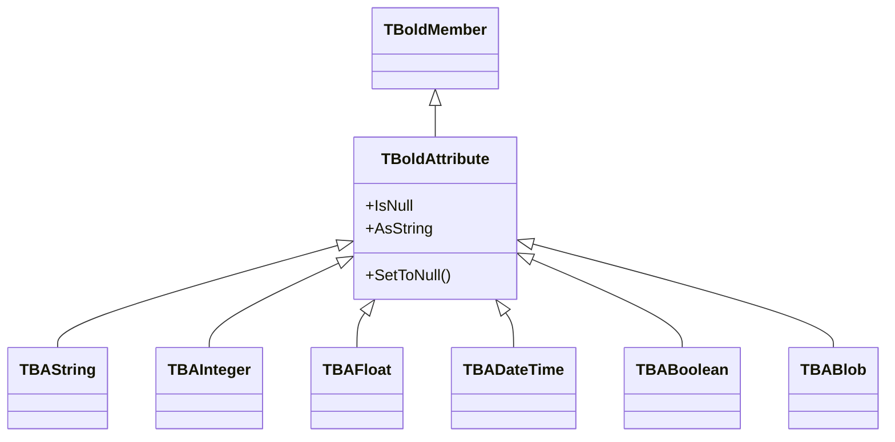

# TBoldAttribute

`TBoldAttribute` stores attribute values for Bold objects. Bold provides type-specific subclasses for different data types.

## Class Hierarchy



## Attribute Types

| Bold Type | Delphi Type | UML Type |
|-----------|-------------|----------|
| `TBAString` | `string` | String |
| `TBAInteger` | `Integer` | Integer |
| `TBAFloat` | `Double` | Float, Currency |
| `TBADateTime` | `TDateTime` | DateTime, Date |
| `TBABoolean` | `Boolean` | Boolean |
| `TBABlob` | `TStream` | Blob |
| `TBACurrency` | `Currency` | Currency |

## Class Definition

```pascal
TBoldAttribute = class(TBoldMember)
public
  // Null handling
  property IsNull: Boolean;
  procedure SetToNull;

  // Universal access
  property AsString: string;

  // Comparison
  function CompareToAs(Other: TBoldAttribute): Integer;
  function IsEqual(Other: TBoldAttribute): Boolean;
end;

// Type-specific classes
TBAString = class(TBoldAttribute)
public
  property AsString: string;
  property Length: Integer;
end;

TBAInteger = class(TBoldAttribute)
public
  property AsInteger: Integer;
end;

TBAFloat = class(TBoldAttribute)
public
  property AsFloat: Double;
end;

TBADateTime = class(TBoldAttribute)
public
  property AsDateTime: TDateTime;
end;

TBABoolean = class(TBoldAttribute)
public
  property AsBoolean: Boolean;
end;
```

## Working with Attributes

### Reading Values

```pascal
var
  Name: string;
  Age: Integer;
  Salary: Double;
  HireDate: TDateTime;
  Active: Boolean;
begin
  Name := Customer.Name;
  Age := Customer.Age;
  Salary := Employee.Salary;
  HireDate := Employee.HireDate;
  Active := Customer.Active;
end;
```

### Writing Values

```pascal
Customer.Name := 'Acme Corp';
Customer.Age := 25;
Employee.Salary := 50000.00;
Employee.HireDate := Now;
Customer.Active := True;
```

### Null Handling

```pascal
// Check for null
if Customer.M_Email.IsNull then
  ShowMessage('No email');

// Set to null
Customer.M_Email.SetToNull;

// Use default value for null
var Email: string;
if Customer.M_Email.IsNull then
  Email := 'N/A'
else
  Email := Customer.Email;
```

## Raw Member Access

Use `M_` prefix for raw attribute access:

```pascal
// Check null state
if Customer.M_Name.IsNull then ...

// Subscribe to changes
Customer.M_Name.DefaultSubscribe(Subscriber);

// Compare attributes
if Customer.M_Name.IsEqual(OtherCustomer.M_Name) then ...
```

## Attribute Metadata

```pascal
var
  Attr: TBoldAttribute;
  Info: TBoldMemberRTInfo;
begin
  Attr := Customer.M_Name;
  Info := Attr.BoldMemberRTInfo;

  Log('Name: ' + Info.ExpressionName);
  Log('Type: ' + Info.BoldType.ExpressionName);
  Log('Persistent: ' + BoolToStr(Info.IsPersistent, True));
end;
```

## Derived Attributes

Attributes can be derived (calculated) from other values:

```pascal
// In UML model, mark Total as derived
// Bold generates deriver code:

procedure TOrder._TotalDeriveAndSubscribe(DerivedObject: TObject;
  Subscriber: TBoldSubscriber);
begin
  // Subscribe to dependencies
  M_Quantity.DefaultSubscribe(Subscriber);
  M_UnitPrice.DefaultSubscribe(Subscriber);

  // Calculate
  M_Total.AsFloat := Quantity * UnitPrice;
end;
```

The derived value automatically updates when dependencies change.

## Common Patterns

### Safe Value Access

```pascal
function SafeString(Attr: TBAString; Default: string = ''): string;
begin
  if Attr.IsNull then
    Result := Default
  else
    Result := Attr.AsString;
end;

// Usage
Email := SafeString(Customer.M_Email, 'no-email@example.com');
```

### Format for Display

```pascal
function FormatMoney(Attr: TBAFloat): string;
begin
  if Attr.IsNull then
    Result := '-'
  else
    Result := FormatFloat('$#,##0.00', Attr.AsFloat);
end;
```

### Validate Before Save

```pascal
procedure ValidateCustomer(Customer: TCustomer);
begin
  if Customer.M_Name.IsNull then
    raise Exception.Create('Name is required');

  if Customer.Name.Trim.IsEmpty then
    raise Exception.Create('Name cannot be empty');
end;
```

## See Also

- [TBoldMember](TBoldMember.md) - Base class
- [TBoldObject](TBoldObject.md) - Attribute owner
- [Subscriptions](../concepts/subscriptions.md) - Reacting to changes
