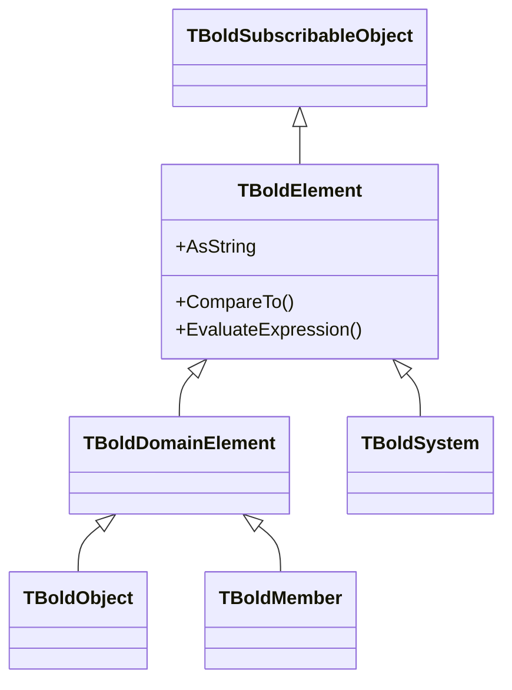

# TBoldElement

`TBoldElement` is the abstract base class for all elements in the Bold framework. It provides common functionality for string representation, comparison, assignment, and subscription.

## Class Definition

```pascal
TBoldElement = class(TBoldSubscribableObject)
public
  // String representation
  property AsString: string;
  property DisplayName: string;
  function GetStringRepresentation(Representation: TBoldRepresentation): string;
  procedure SetStringRepresentation(Representation: TBoldRepresentation; const Value: string);

  // Comparison
  function CompareTo(BoldElement: TBoldElement): Integer;
  function IsEqual(BoldElement: TBoldElement): Boolean;

  // Assignment
  procedure Assign(Source: TBoldElement);
  function IsEqualAs(CompareType: TBoldCompareType; BoldElement: TBoldElement): Boolean;

  // OCL evaluation
  function EvaluateExpression(const Expression: string): TBoldElement;
  function EvaluateExpressionAsNewElement(const Expression: string): TBoldElement;

  // Mutability
  property Mutable: Boolean;
end;
```

## Inheritance



## Properties

### AsString

Universal string representation:

```pascal
var
  Element: TBoldElement;
begin
  ShowMessage(Element.AsString);
end;
```

### DisplayName

Human-readable name for display purposes:

```pascal
ShowMessage('Working with: ' + Element.DisplayName);
```

### Mutable

Indicates whether the element can be modified:

```pascal
if Element.Mutable then
  Element.AsString := 'New Value';
```

## Methods

### CompareTo

Compare two elements:

```pascal
var
  Result: Integer;
begin
  Result := Element1.CompareTo(Element2);
  // Result < 0: Element1 < Element2
  // Result = 0: Element1 = Element2
  // Result > 0: Element1 > Element2
end;
```

### IsEqual

Check equality:

```pascal
if Element1.IsEqual(Element2) then
  ShowMessage('Elements are equal');
```

### Assign

Copy value from another element:

```pascal
TargetElement.Assign(SourceElement);
```

### EvaluateExpression

Evaluate an OCL expression with this element as context:

```pascal
var
  Customer: TBoldObject;
  OrderCount: TBoldElement;
begin
  OrderCount := Customer.EvaluateExpression('self.orders->size');
  ShowMessage('Orders: ' + OrderCount.AsString);
end;
```

### EvaluateExpressionAsNewElement

Evaluate and return a new element (caller owns it):

```pascal
var
  Customer: TBoldObject;
  ActiveOrders: TBoldObjectList;
begin
  ActiveOrders := Customer.EvaluateExpressionAsNewElement(
    'self.orders->select(status = ''Active'')'
  ) as TBoldObjectList;
  try
    // Use ActiveOrders
  finally
    ActiveOrders.Free;
  end;
end;
```

## String Representations

Bold supports multiple string representations for different purposes:

| Representation | Constant | Purpose |
|----------------|----------|---------|
| Default | `brDefault` | General display |
| Short | `brShort` | Compact display |
| Long | `brLong` | Detailed display |

```pascal
// Get specific representation
var
  ShortName: string;
begin
  ShortName := Element.GetStringRepresentation(brShort);
end;
```

## Derived Classes

| Class | Description |
|-------|-------------|
| [TBoldSystem](TBoldSystem.md) | The Object Space manager |
| TBoldDomainElement | Base for objects and members |
| [TBoldObject](TBoldObject.md) | Domain object instances |
| [TBoldMember](TBoldMember.md) | Attributes and references |
| [TBoldAttribute](TBoldAttribute.md) | Simple values |
| [TBoldObjectList](TBoldObjectList.md) | Collections |

## See Also

- [TBoldSystem](TBoldSystem.md) - Object Space manager
- [TBoldObject](TBoldObject.md) - Domain objects
- [Subscriptions](../concepts/subscriptions.md) - Change notification
