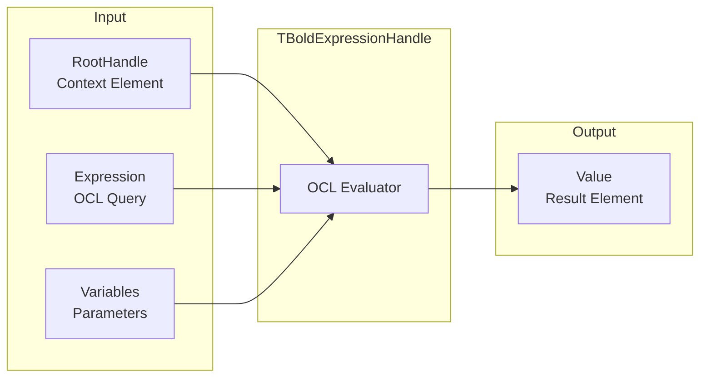

# TBoldExpressionHandle

`TBoldExpressionHandle` evaluates an OCL expression and provides access to a single value result. It's the foundation for data binding and derived values.

## Class Definition

```pascal
TBoldExpressionHandle = class(TBoldRootedHandle)
public
  // Core access
  property Value: TBoldElement;

  // Configuration
  property Expression: TBoldExpression;
  property RootHandle: TBoldElementHandle;
  property Variables: TBoldOclVariables;

  // Performance
  property EvaluateInPS: Boolean;
  property UsePrefetch: Boolean;

  // Subscription
  property Subscribe: Boolean;
end;
```

## How It Works



## Properties

### Expression

The OCL expression to evaluate:

```pascal
// Simple attribute access
BoldExpressionHandle1.Expression := 'name';

// Calculated value
BoldExpressionHandle1.Expression := 'orders->size';

// Complex expression
BoldExpressionHandle1.Expression := 'orders->select(status = ''Pending'')->collect(total)->sum';
```

### RootHandle

The context element for expression evaluation:

```pascal
// Evaluate expression relative to selected customer
BoldExpressionHandle1.RootHandle := CustomerListHandle;
BoldExpressionHandle1.Expression := 'orders->size';
```

### Value

The result of the expression:

```pascal
var
  OrderCount: Integer;
begin
  OrderCount := (BoldExpressionHandle1.Value as TBAInteger).AsInteger;
  ShowMessage(Format('Customer has %d orders', [OrderCount]));
end;
```

### Variables

OCL variables for parameterized expressions:

```pascal
// Expression with parameter
BoldExpressionHandle1.Expression := 'orders->select(total > minAmount)->size';
BoldOclVariables1.SetVariable('minAmount', '1000');
BoldExpressionHandle1.Variables := BoldOclVariables1;
```

### Subscribe

When True, automatically updates when source data changes:

```pascal
// Enable auto-refresh
BoldExpressionHandle1.Subscribe := True;
```

### EvaluateInPS

When True, the OCL expression is evaluated in the database (Persistence Storage) instead of in memory. This is essential for aggregates on large datasets:

```pascal
// Count active customers in database - fast even with millions of records
BoldExpressionHandle1.EvaluateInPS := True;
BoldExpressionHandle1.Expression := 'Customer.allInstances->select(active)->size';
```

## Common Use Cases

### Display Calculated Values

```pascal
// Show order total
BoldExpressionHandle1.RootHandle := OrderHandle;
BoldExpressionHandle1.Expression := 'items->collect(quantity * unitPrice)->sum';
// Bind to TBoldEdit or TBoldLabel
```

### Conditional Logic

```pascal
// Check if customer has unpaid orders
BoldExpressionHandle1.Expression := 'orders->exists(paid = false)';

procedure CheckPaymentStatus;
var
  HasUnpaid: Boolean;
begin
  HasUnpaid := (BoldExpressionHandle1.Value as TBABoolean).AsBoolean;
  if HasUnpaid then
    ShowMessage('Customer has unpaid orders');
end;
```

### Navigation Property

```pascal
// Get related object
BoldExpressionHandle1.RootHandle := OrderHandle;
BoldExpressionHandle1.Expression := 'customer';

var
  Customer: TCustomer;
begin
  Customer := BoldExpressionHandle1.Value as TCustomer;
end;
```

### Aggregate Calculations

```pascal
// Sum of all order totals
BoldExpressionHandle1.Expression := 'Order.allInstances->collect(total)->sum';

// Average order value
BoldExpressionHandle1.Expression := 'Order.allInstances->collect(total)->average';

// Count active customers
BoldExpressionHandle1.Expression := 'Customer.allInstances->select(active)->size';
```

## Binding to UI Components

### With TBoldEdit

```pascal
// Design time: Set BoldHandle property
BoldEdit1.BoldHandle := BoldExpressionHandle1;
```

### With TBoldLabel

```pascal
// Display calculated value
BoldLabel1.BoldHandle := BoldExpressionHandle1;
```

### With TBoldCheckBox

```pascal
// Boolean expression
BoldExpressionHandle1.Expression := 'active';
BoldCheckBox1.BoldHandle := BoldExpressionHandle1;
```

## Chaining Handles

```pascal
// System -> Customer List -> Current Customer -> Order Count
BoldSystemHandle1                           // System
  -> BoldListHandle1 (Customer.allInstances) // All customers
    -> BoldExpressionHandle1 (orders->size)  // Order count for current
```

## Read-Only vs Editable

Expression handles are typically read-only for complex expressions. For editable values, use simple attribute expressions:

```pascal
// Editable (simple attribute)
BoldExpressionHandle1.Expression := 'name';

// Read-only (calculated)
BoldExpressionHandle2.Expression := 'firstName + '' '' + lastName';
```

## Performance Tips

1. Set `Subscribe := False` for one-time evaluations
2. Use `EvaluateInPS := True` for aggregates on large datasets
3. Cache results when expression is expensive and data rarely changes

## See Also

- [TBoldListHandle](TBoldListHandle.md) - List expressions
- [TBoldSystemHandle](TBoldSystemHandle.md) - System management
- [OCL Queries](../concepts/ocl.md) - Query language reference
