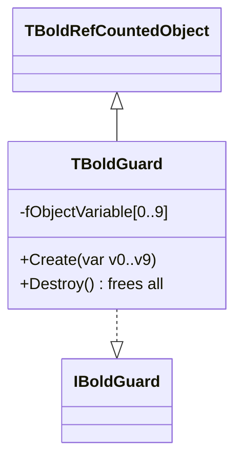

# TBoldGuard

`TBoldGuard` provides automatic memory management for local objects using Delphi's interface reference counting. When the guard goes out of scope, all tracked objects are freed automatically — even if an exception occurs.

## Class Hierarchy



## Class Definition

```pascal
IBoldGuard = interface(IUnknown)
end;

TBoldGuard = class(TBoldRefCountedObject, IBoldGuard)
public
  // Overloaded constructors for 1 to 10 variables
  constructor Create(var v0); overload;
  constructor Create(var v0, v1); overload;
  constructor Create(var v0, v1, v2); overload;
  // ... up to 10 variables
  constructor Create(var v0, v1, v2, v3, v4, v5, v6, v7, v8, v9); overload;
  destructor Destroy; override;
end;
```

## How It Works

1. Declare a local `IBoldGuard` variable (interface type)
2. Assign `TBoldGuard.Create(var1, var2, ...)` — constructor sets all variables to `nil`
3. Create objects and assign to the tracked variables
4. When the procedure exits (normally or by exception), the interface ref count drops to 0
5. `Destroy` frees all non-nil tracked objects in reverse order

This pattern predates Delphi's ARC and is similar to Go's `defer` or Python's context managers.

## Before and After

### Without TBoldGuard

```pascal
procedure ProcessData;
var
  List: TStringList;
  Stream: TFileStream;
  Parser: TParser;
begin
  List := nil;
  Stream := nil;
  Parser := nil;
  try
    List := TStringList.Create;
    Stream := TFileStream.Create('data.txt', fmOpenRead);
    Parser := TParser.Create;

    // ... use objects ...

  finally
    Parser.Free;
    Stream.Free;
    List.Free;
  end;
end;
```

### With TBoldGuard

```pascal
procedure ProcessData;
var
  Guard: IBoldGuard;
  List: TStringList;
  Stream: TFileStream;
  Parser: TParser;
begin
  Guard := TBoldGuard.Create(List, Stream, Parser);
  // All three are now nil and will be freed automatically

  List := TStringList.Create;
  Stream := TFileStream.Create('data.txt', fmOpenRead);
  Parser := TParser.Create;

  // ... use objects ...
  // No try/finally needed — Guard frees everything on exit
end;
```

## Common Patterns

### Bold Source Code Usage

`TBoldGuard` is used extensively throughout Bold's source code:

```pascal
procedure TBoldOcl.Evaluate(const Expr: string);
var
  Guard: IBoldGuard;
  Env: TBoldOclEnvironment;
  Node: TBoldOLWNode;
begin
  Guard := TBoldGuard.Create(Env, Node);
  Env := TBoldOclEnvironment.Create;
  Node := ParseExpression(Expr);
  // ... evaluate ...
end;  // Env and Node freed automatically
```

### Maximum 10 Variables

The guard supports up to 10 variables (`MAXARRAY = 9`, zero-indexed). If you need more, use multiple guards or reconsider your design.

```pascal
var
  Guard1, Guard2: IBoldGuard;
  A, B, C, D, E, F, G, H, I, J: TObject;
  K, L: TObject;
begin
  Guard1 := TBoldGuard.Create(A, B, C, D, E, F, G, H, I, J);
  Guard2 := TBoldGuard.Create(K, L);
  // ...
end;
```

!!! tip "Variables are set to nil"
    The constructor sets all passed variables to `nil`. You don't need to initialize them yourself. Only non-nil objects are freed in the destructor.

## See Also

- [TBoldSystem](TBoldSystem.md) - Object Space (uses guards internally)
- [TBoldElement](TBoldElement.md) - Base element class
