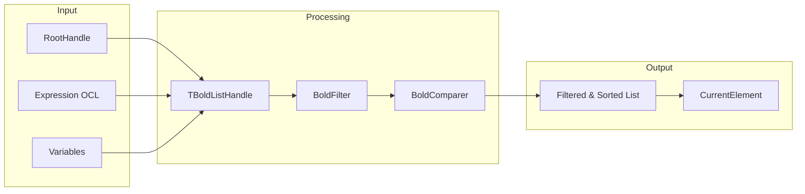

# TBoldListHandle

`TBoldListHandle` is a powerful component for working with collections of Bold objects. It combines OCL expression evaluation, filtering, sorting, and cursor functionality.

## Class Definition

```pascal
TBoldListHandle = class(TBoldCursorHandle)
public
  // Core access
  property List: TBoldList;
  property CurrentElement: TBoldElement;
  property CurrentIndex: Integer;

  // Configuration
  property Expression: TBoldExpression;
  property RootHandle: TBoldElementHandle;
  property Variables: TBoldOclVariables;

  // Processing
  property BoldFilter: TBoldFilter;
  property BoldComparer: TBoldComparer;

  // Performance
  property EvaluateInPS: Boolean;
  property UsePrefetch: Boolean;
end;
```

## Component Diagram



## Properties

### Expression

OCL expression that evaluates to a list:

```pascal
// Get all customers
BoldListHandle1.Expression := 'Customer.allInstances';

// Get orders for current customer
BoldListHandle2.Expression := 'orders';
BoldListHandle2.RootHandle := CustomerHandle;
```

### RootHandle

The context element for expression evaluation:

```pascal
// Orders relative to a customer
BoldListHandle1.RootHandle := BoldReferenceHandle1; // Points to a customer
BoldListHandle1.Expression := 'orders';
```

### Variables

OCL variables for parameterized expressions:

```pascal
// Filter by status variable
BoldListHandle1.Expression := 'Order.allInstances->select(status = statusVar)';
BoldListHandle1.Variables := BoldOclVariables1;

// Set variable value (in code or at design-time)
BoldOclVariables1.SetVariable('statusVar', 'Pending');
```

### BoldFilter

Runtime filter (in addition to OCL):

```pascal
// Add dynamic filter
BoldListHandle1.BoldFilter := BoldFilter1;

// In filter component
procedure TForm1.BoldFilter1Filter(Element: TBoldElement; var Accept: Boolean);
begin
  Accept := (Element as TCustomer).Active;
end;
```

### BoldComparer

Sort the results:

```pascal
// Add sorting
BoldListHandle1.BoldComparer := BoldComparer1;

// In comparer component
procedure TForm1.BoldComparer1Compare(Item1, Item2: TBoldElement; var Result: Integer);
begin
  Result := CompareStr(
    (Item1 as TCustomer).Name,
    (Item2 as TCustomer).Name
  );
end;
```

### List

Access the resulting list:

```pascal
var
  i: Integer;
begin
  for i := 0 to BoldListHandle1.List.Count - 1 do
    ProcessElement(BoldListHandle1.List[i]);
end;
```

### CurrentElement / CurrentIndex

Cursor functionality:

```pascal
// Navigate
BoldListHandle1.CurrentIndex := 0;  // First
BoldListHandle1.CurrentIndex := BoldListHandle1.Count - 1;  // Last

// Access current
var
  Current: TCustomer;
begin
  Current := BoldListHandle1.CurrentElement as TCustomer;
end;
```

### EvaluateInPS

When True, the OCL expression is evaluated in the database (Persistence Storage) instead of in memory. This is much faster for large datasets because only matching objects are fetched:

```pascal
// Evaluate filter in database - fetches only active customers
BoldListHandle1.EvaluateInPS := True;
BoldListHandle1.Expression := 'Customer.allInstances->select(active = true)';

// Without EvaluateInPS, all customers would be loaded into memory first, then filtered
```

### UsePrefetch

Prefetch related data for better performance:

```pascal
// Enable prefetching (default is True)
BoldListHandle1.UsePrefetch := True;
```

## Common Patterns

### Master-Detail Setup

```pascal
// Master: All customers
BoldListHandleCustomers.Expression := 'Customer.allInstances';

// Detail: Orders for selected customer
BoldListHandleOrders.RootHandle := BoldListHandleCustomers;
BoldListHandleOrders.Expression := 'orders';
```

### Filtered List

```pascal
// OCL filter
BoldListHandle1.Expression := 'Customer.allInstances->select(active and balance > 1000)';

// Or with runtime filter
BoldListHandle1.Expression := 'Customer.allInstances';
BoldListHandle1.BoldFilter := BoldFilter1;
```

### Sorted List

```pascal
// OCL sorting
BoldListHandle1.Expression := 'Customer.allInstances->orderby(name)';

// Or with runtime comparer
BoldListHandle1.Expression := 'Customer.allInstances';
BoldListHandle1.BoldComparer := BoldComparer1;
```

### Parameterized Query

```pascal
// Expression with variable
BoldListHandle1.Expression := 'Order.allInstances->select(orderDate >= startDate)';

// Set variable value
BoldOclVariables1.SetVariable('startDate', DateToStr(Date - 30));
```

## Connecting to UI

### With TBoldGrid

```pascal
// At design time, set:
BoldGrid1.BoldHandle := BoldListHandle1;
```

### With TBoldNavigator

```pascal
// At design time, set:
BoldNavigator1.BoldHandle := BoldListHandle1;
```

### Manual Iteration

```pascal
procedure ProcessAllCustomers;
var
  i: Integer;
  Customer: TCustomer;
begin
  for i := 0 to BoldListHandle1.Count - 1 do
  begin
    Customer := BoldListHandle1.List[i] as TCustomer;
    // Process customer
  end;
end;
```

## Performance Tips

1. Use `EvaluateInPS := True` for large datasets
2. Keep `UsePrefetch := True` for related data access
3. Use OCL filters instead of runtime filters when possible
4. Limit result sets with `->first(n)` or pagination

## See Also

- [TBoldExpressionHandle](TBoldExpressionHandle.md) - Single value expressions
- [TBoldSystemHandle](TBoldSystemHandle.md) - System management
- [OCL Queries](../concepts/ocl.md) - Query language reference
