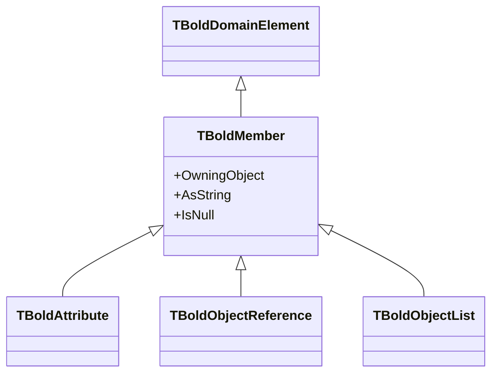

# TBoldMember

`TBoldMember` is the abstract base class for all member types in Bold objects: attributes, references, and lists.

## Class Definition

```pascal
TBoldMember = class(TBoldDomainElement)
public
  // Owning object
  property OwningObject: TBoldObject;
  property BoldSystem: TBoldSystem;

  // Type information
  property BoldMemberRTInfo: TBoldMemberRTInfo;
  property DisplayName: string;

  // Value access
  property AsString: string;
  property IsNull: Boolean;

  // State
  property BoldDirty: Boolean;

  // Subscriptions
  procedure DefaultSubscribe(Subscriber: TBoldSubscriber);
end;
```

## Inheritance



## Member Types

| Type | Description | Example |
|------|-------------|---------|
| `TBoldAttribute` | Stores a value | `Customer.Name` |
| `TBoldObjectReference` | Single object link | `Order.Customer` |
| `TBoldObjectList` | Multiple object links | `Customer.Orders` |

## Properties

### OwningObject

Get the object that owns this member:

```pascal
var
  Member: TBoldMember;
  Owner: TBoldObject;
begin
  Member := Customer.BoldMemberByName['Name'];
  Owner := Member.OwningObject;  // Returns Customer
end;
```

### AsString

Universal string representation:

```pascal
var
  i: Integer;
  Member: TBoldMember;
begin
  for i := 0 to Customer.BoldMemberCount - 1 do
  begin
    Member := Customer.BoldMembers[i];
    Log(Member.DisplayName + ' = ' + Member.AsString);
  end;
end;
```

### IsNull

Check if member has no value:

```pascal
if Customer.M_Email.IsNull then
  ShowMessage('No email address');
```

### BoldDirty

Check if member has unsaved changes:

```pascal
if Customer.M_Name.BoldDirty then
  HighlightField(NameEdit);
```

## Subscriptions

Members support the subscription pattern:

```pascal
// Subscribe to changes
Customer.M_Name.DefaultSubscribe(MySubscriber);

// When Name changes, subscriber is notified
```

## Accessing Members

### By Generated Property

```pascal
// Preferred - type safe
CustomerName := Customer.Name;  // string
CustomerOrders := Customer.Orders;  // TOrderList
```

### By Index

```pascal
// Generic access
Member := Customer.BoldMembers[0];
```

### By Name

```pascal
// Dynamic access
Member := Customer.BoldMemberByName['Name'];
```

## Member Naming Convention

Generated code uses `M_` prefix for raw member access:

```pascal
TCustomer = class(TBoldObject)
private
  // Raw member access (internal)
  function _Get_M_Name: TBAString;
public
  // Typed property (use this)
  property Name: string read GetName write SetName;

  // Raw member access (advanced use)
  property M_Name: TBAString read _Get_M_Name;
end;
```

Use `M_Name` when you need:
- To check `IsNull`
- To subscribe to changes
- To access metadata

## Common Patterns

### Iterate All Members

```pascal
procedure LogAllMembers(Obj: TBoldObject);
var
  i: Integer;
  Member: TBoldMember;
begin
  for i := 0 to Obj.BoldMemberCount - 1 do
  begin
    Member := Obj.BoldMembers[i];
    Log(Format('%s: %s', [Member.DisplayName, Member.AsString]));
  end;
end;
```

### Find Changed Members

```pascal
procedure ListDirtyMembers(Obj: TBoldObject);
var
  i: Integer;
  Member: TBoldMember;
begin
  for i := 0 to Obj.BoldMemberCount - 1 do
  begin
    Member := Obj.BoldMembers[i];
    if Member.BoldDirty then
      Log('Changed: ' + Member.DisplayName);
  end;
end;
```

## See Also

- [TBoldAttribute](TBoldAttribute.md) - Value attributes
- [TBoldObjectList](TBoldObjectList.md) - Multi-valued associations
- [TBoldObject](TBoldObject.md) - Owner of members
