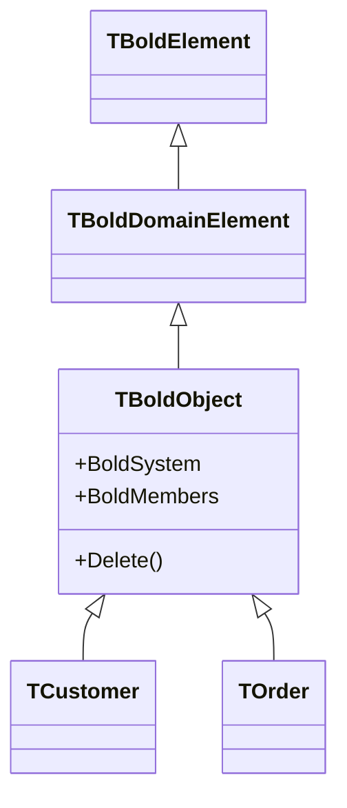
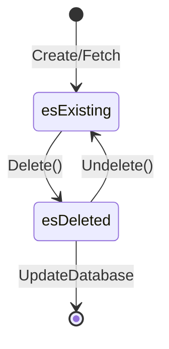

# TBoldObject

`TBoldObject` is the base class for all domain objects in Bold. Your generated business classes inherit from this class.

## Class Definition

```pascal
TBoldObject = class(TBoldDomainElement)
public
  // System access
  property BoldSystem: TBoldSystem;
  property BoldClassTypeInfo: TBoldClassTypeInfo;

  // Members
  property BoldMembers[Index: Integer]: TBoldMember;
  property BoldMemberCount: Integer;
  property BoldMemberByName[const Name: string]: TBoldMember;

  // Identity
  property BoldObjectLocator: TBoldObjectLocator;
  function BoldObjectId: TBoldObjectId;

  // State
  property BoldExistenceState: TBoldExistenceState;
  property BoldPersistenceState: TBoldPersistenceState;
  property BoldDirty: Boolean;

  // Operations
  procedure Delete;
  procedure Undelete;
end;
```

## Inheritance



## Object States

### Existence State



| State | Description |
|-------|-------------|
| `esExisting` | Object exists and is active |
| `esDeleted` | Object marked for deletion |

### Persistence State

| State | Description |
|-------|-------------|
| `psNew` | Created, not yet saved |
| `psClean` | Saved, no pending changes |
| `psModified` | Has unsaved modifications |

## Properties

### BoldMembers

Access attributes and references by index:

```pascal
var
  Member: TBoldMember;
begin
  for i := 0 to Customer.BoldMemberCount - 1 do
  begin
    Member := Customer.BoldMembers[i];
    Log(Member.DisplayName + ': ' + Member.AsString);
  end;
end;
```

### BoldMemberByName

Access by name:

```pascal
var
  NameAttr: TBoldAttribute;
begin
  NameAttr := Customer.BoldMemberByName['Name'] as TBoldAttribute;
  NameAttr.AsString := 'New Name';
end;
```

### BoldDirty

Check if object has unsaved changes:

```pascal
if Customer.BoldDirty then
  ShowMessage('Customer has unsaved changes');
```

## Methods

### Delete

Mark object for deletion:

```pascal
Customer.Delete;
// Object still exists until UpdateDatabase
BoldSystem.UpdateDatabase;
// Now removed from database
```

### Undelete

Restore a deleted object (before UpdateDatabase):

```pascal
Customer.Delete;
// Changed my mind
Customer.Undelete;
```

## Generated Properties

Code generation creates typed properties for your model:

```pascal
// Generated in BusinessClasses.pas
TCustomer = class(TBoldObject)
private
  function GetName: string;
  procedure SetName(const Value: string);
  function GetOrders: TOrderList;
public
  property Name: string read GetName write SetName;
  property Orders: TOrderList read GetOrders;
end;
```

Usage:

```pascal
var
  Customer: TCustomer;
begin
  Customer := TCustomer.Create(BoldSystem);
  Customer.Name := 'Acme Corp';

  for Order in Customer.Orders do
    ProcessOrder(Order);
end;
```

## Common Patterns

### Check Before Delete

```pascal
procedure SafeDelete(Obj: TBoldObject);
begin
  if Obj.BoldExistenceState = esExisting then
    Obj.Delete;
end;
```

### Clone Object

Bold doesn't have built-in cloning. Manual approach:

```pascal
function CloneCustomer(Source: TCustomer): TCustomer;
begin
  Result := TCustomer.Create(Source.BoldSystem);
  Result.Name := Source.Name;
  Result.Email := Source.Email;
  // Don't copy ID or references usually
end;
```

### Compare Objects

```pascal
function SameObject(A, B: TBoldObject): Boolean;
begin
  Result := A.BoldObjectLocator = B.BoldObjectLocator;
end;
```

## See Also

- [TBoldSystem](TBoldSystem.md) - Object Space manager
- [TBoldMember](TBoldMember.md) - Attributes and references
- [TBoldObjectList](TBoldObjectList.md) - Collections
