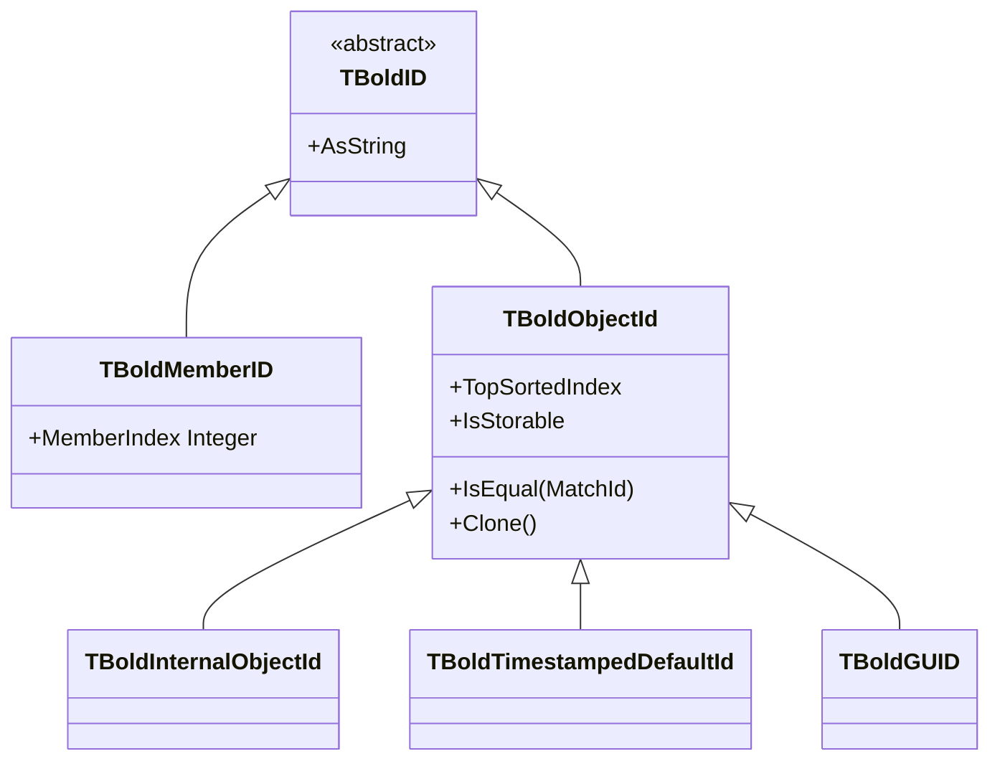

# TBoldObjectId

`TBoldObjectId` is the abstract base class for object identity in Bold's persistence layer. Every Bold object has a unique ID that persists across sessions and is used for database storage, object lookup, and cross-system references.

## Class Hierarchy



## Class Definition

```pascal
TBoldID = class(TBoldNonRefCountedObject, IBoldStreamable)
public
  property AsString: string;
end;

TBoldMemberID = class(TBoldID)
public
  constructor Create(MemberIndex: Integer);
  property MemberIndex: Integer;
end;

TBoldObjectId = class(TBoldID)
public
  constructor CreateWithClassID(TopSortedIndex: Integer; Exact: Boolean); virtual;
  function Clone: TBoldObjectId;
  function CloneWithClassId(TopSortedIndex: Integer; Exact: Boolean): TBoldObjectId; virtual; abstract;
  property TopSortedIndex: Integer;      // class type reference
  property TopSortedIndexExact: Boolean; // exact class or could be subclass?
  property IsStorable: Boolean;          // can be persisted?
  property IsEqual[MatchId: TBoldObjectId]: Boolean;
  property NonExisting: Boolean;
end;
```

## ID Types

| Type | Purpose | Storage |
|------|---------|---------|
| `TBoldInternalObjectId` | Temporary in-memory ID | Not persisted |
| `TBoldTimestampedDefaultId` | Database integer + timestamp | DB integer column |
| `TBoldGUID` | Globally unique identifier | GUID string |

## Working with Object IDs

### Accessing an Object's ID

```pascal
var
  ObjectId: TBoldObjectId;
  IdString: string;
begin
  ObjectId := Customer.BoldObjectLocator.BoldObjectID;
  IdString := ObjectId.AsString;
  // e.g., "42" for integer ID, or a GUID string
end;
```

### Looking Up Objects by ID

```pascal
var
  Locator: TBoldObjectLocator;
  Customer: TCustomer;
begin
  Locator := BoldSystem.Locators.ObjectByID[SomeObjectId];
  if Assigned(Locator) and Assigned(Locator.BoldObject) then
    Customer := Locator.BoldObject as TCustomer;
end;
```

### TopSortedIndex

The `TopSortedIndex` links the ID to a class in the model's type hierarchy. Classes are sorted topologically (superclasses before subclasses). When `TopSortedIndexExact` is `True`, the ID refers to exactly that class; when `False`, it could be any subclass.

### TBoldMemberID

`TBoldMemberID` identifies a specific member (attribute or role) within an object, by its index in the class's member list.

```pascal
var
  MemberId: TBoldMemberID;
begin
  MemberId := TBoldMemberID.Create(0);  // first member
  // Used internally for persistence operations
end;
```

## See Also

- [TBoldObject](TBoldObject.md) - Domain objects that have IDs
- [TBoldSystem](TBoldSystem.md) - Object Space with locator lookup
- [Persistence](../concepts/persistence.md) - Database mapping
