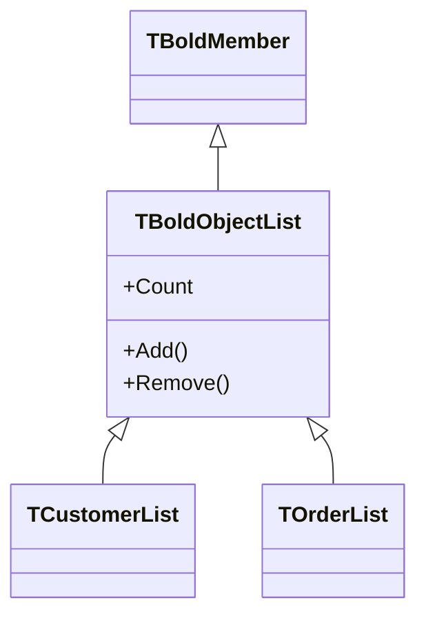

# TBoldObjectList

`TBoldObjectList` represents a collection of Bold objects. It's used for multi-valued associations (one-to-many, many-to-many) and query results.

## Class Definition

```pascal
TBoldObjectList = class(TBoldMember)
public
  // Access
  property BoldObjects[Index: Integer]: TBoldObject;
  property Count: Integer;
  function First: TBoldObject;
  function Last: TBoldObject;

  // Modification
  function Add(AObject: TBoldObject): Integer;
  procedure Insert(Index: Integer; AObject: TBoldObject);
  function Remove(AObject: TBoldObject): Integer;
  procedure RemoveByIndex(Index: Integer);
  procedure Clear;

  // Query
  function IndexOf(AObject: TBoldObject): Integer;
  function Includes(AObject: TBoldObject): Boolean;

  // Iteration
  function GetEnumerator: TBoldObjectListEnumerator;
end;
```

## Inheritance



## Properties

### BoldObjects / Count

Access elements by index:

```pascal
var
  i: Integer;
  Customer: TCustomer;
begin
  for i := 0 to CustomerList.Count - 1 do
  begin
    Customer := CustomerList.BoldObjects[i] as TCustomer;
    ProcessCustomer(Customer);
  end;
end;
```

### First / Last

Quick access to endpoints:

```pascal
var
  FirstCustomer: TCustomer;
begin
  if CustomerList.Count > 0 then
    FirstCustomer := CustomerList.First as TCustomer;
end;
```

## Methods

### Add

Add object to list:

```pascal
var
  Order: TOrder;
begin
  Order := TOrder.Create(BoldSystem);
  Customer.Orders.Add(Order);
  // Order is now linked to Customer
end;
```

### Remove

Remove object from list:

```pascal
Customer.Orders.Remove(SomeOrder);
// Object still exists, just not in this list
```

### Clear

Remove all objects:

```pascal
Customer.Orders.Clear;
// All orders unlinked from customer
```

### IndexOf / Includes

Check membership:

```pascal
if Customer.Orders.Includes(AnOrder) then
  ShowMessage('Order belongs to this customer');

var Index := Customer.Orders.IndexOf(AnOrder);
if Index >= 0 then
  ShowMessage('Found at index ' + IntToStr(Index));
```

## Iteration

### For-In Loop

```pascal
var
  Order: TOrder;
begin
  for Order in Customer.Orders do
    ProcessOrder(Order);
end;
```

### Traditional Loop

```pascal
var
  i: Integer;
begin
  for i := 0 to Customer.Orders.Count - 1 do
    ProcessOrder(Customer.Orders[i] as TOrder);
end;
```

### Reverse Iteration (for deletion)

```pascal
var
  i: Integer;
begin
  for i := Customer.Orders.Count - 1 downto 0 do
    if ShouldDelete(Customer.Orders[i]) then
      Customer.Orders.RemoveByIndex(i);
end;
```

## Generated Typed Lists

Code generation creates typed list classes:

```pascal
// Generated in BusinessClasses.pas
TOrderList = class(TBoldObjectList)
public
  property Items[Index: Integer]: TOrder; default;
  function First: TOrder;
  function Last: TOrder;
end;
```

Usage:

```pascal
var
  Order: TOrder;
begin
  // Type-safe access
  Order := Customer.Orders[0];  // Returns TOrder, not TBoldObject
  Order := Customer.Orders.First;
end;
```

## Common Patterns

### Filter List

```pascal
function GetPaidOrders(Orders: TOrderList): TBoldObjectList;
begin
  Result := Orders.BoldSystem.EvaluateExpressionAsNewElement(
    'self->select(paid = true)',
    Orders
  ) as TBoldObjectList;
end;
```

### Sum Values

```pascal
function TotalOrderValue(Orders: TOrderList): Currency;
var
  Order: TOrder;
begin
  Result := 0;
  for Order in Orders do
    Result := Result + Order.Total;
end;

// Or with OCL
function TotalOrderValueOCL(Orders: TOrderList): Currency;
begin
  Result := Orders.BoldSystem.EvaluateExpressionAsFloat(
    'self->collect(total)->sum',
    Orders
  );
end;
```

### Copy to Standard List

```pascal
function ToGenericList(BoldList: TBoldObjectList): TList<TBoldObject>;
var
  i: Integer;
begin
  Result := TList<TBoldObject>.Create;
  for i := 0 to BoldList.Count - 1 do
    Result.Add(BoldList.BoldObjects[i]);
end;
```

## See Also

- [TBoldObject](TBoldObject.md) - Elements in the list
- [TBoldMember](TBoldMember.md) - Base class
- [OCL Queries](../concepts/ocl.md) - Query collections
