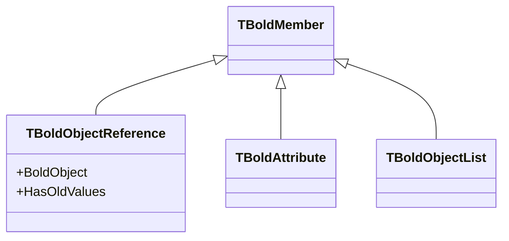
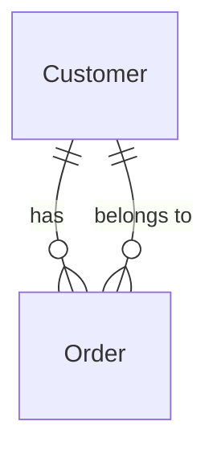
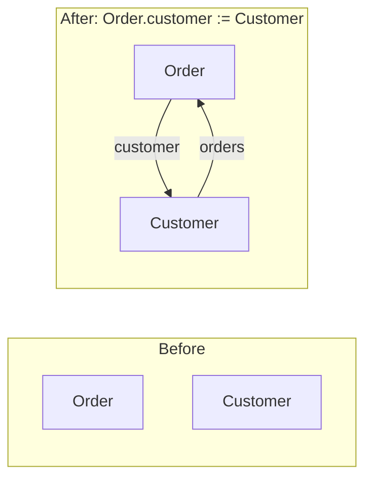

# TBoldObjectReference

`TBoldObjectReference` represents a single-valued association (relationship) between Bold objects. It stores a reference to one other object or nil.

## Class Definition

```pascal
TBoldObjectReference = class(TBoldMember)
public
  // Core access
  property BoldObject: TBoldObject;

  // Navigation
  function GetController: TBoldAbstractController;

  // State
  property HasOldValues: Boolean;
end;
```

## Class Hierarchy



## Understanding References

In UML, associations between classes can be:

| Multiplicity | Bold Class | Example |
|--------------|------------|---------|
| 0..1 or 1 | TBoldObjectReference | Order.customer |
| 0..* or 1..* | TBoldObjectList | Customer.orders |



## Properties

### BoldObject

The referenced object (or nil):

```pascal
var
  Order: TOrder;
  Customer: TCustomer;
begin
  Order := GetCurrentOrder;

  // Get the referenced customer
  Customer := Order.M_customer.BoldObject as TCustomer;

  // Or use the generated property
  Customer := Order.customer;
end;
```

## Working with References

### Reading a Reference

```pascal
var
  Order: TOrder;
  Customer: TCustomer;
begin
  Order := GetCurrentOrder;

  // Check if reference is set
  if Assigned(Order.customer) then
    ShowMessage('Customer: ' + Order.customer.Name)
  else
    ShowMessage('No customer assigned');
end;
```

### Setting a Reference

```pascal
var
  Order: TOrder;
  Customer: TCustomer;
begin
  Order := GetCurrentOrder;
  Customer := GetSelectedCustomer;

  // Set the reference
  Order.customer := Customer;

  // Bold automatically maintains the inverse relationship
  // Customer.orders now includes this Order
end;
```

### Clearing a Reference

```pascal
// Set to nil
Order.customer := nil;

// Or using raw member
Order.M_customer.BoldObject := nil;
```

## Bidirectional Associations

Bold automatically maintains both ends of a bidirectional association:

```pascal
// Setting Order.customer automatically adds Order to Customer.orders
Order.customer := Customer;

// These are now true:
Assert(Order.customer = Customer);
Assert(Customer.orders.Includes(Order));
```



## Raw Member Access

Use `M_` prefix for low-level access:

```pascal
var
  Ref: TBoldObjectReference;
begin
  Ref := Order.M_customer;

  // Check null state
  if Ref.BoldObject = nil then
    ShowMessage('No customer');

  // Subscribe to changes
  Ref.DefaultSubscribe(Subscriber);
end;
```

## Comparing with Attributes

| Aspect | TBoldAttribute | TBoldObjectReference |
|--------|----------------|----------------------|
| Stores | Simple values | Object pointer |
| Example | Name: String | customer: TCustomer |
| Null check | IsNull | BoldObject = nil |
| Generated property | Customer.Name | Order.customer |

## Common Patterns

### Safe Navigation

```pascal
function GetCustomerName(Order: TOrder): string;
begin
  if Assigned(Order.customer) then
    Result := Order.customer.Name
  else
    Result := '(no customer)';
end;
```

### Assign with Validation

```pascal
procedure AssignCustomer(Order: TOrder; Customer: TCustomer);
begin
  if not Assigned(Customer) then
    raise Exception.Create('Customer is required');

  if not Customer.Active then
    raise Exception.Create('Cannot assign inactive customer');

  Order.customer := Customer;
end;
```

### OCL Navigation

```pascal
// Navigate reference in OCL
BoldListHandle1.Expression := 'Order.allInstances->select(customer.active)';

// Get all customers who have orders
BoldListHandle2.Expression := 'Order.allInstances->collect(customer)->asSet';
```

## Subscription

Subscribe to reference changes:

```pascal
procedure TForm1.SubscribeToCustomerChange(Order: TOrder);
begin
  Order.M_customer.DefaultSubscribe(OrderCustomerSubscriber);
end;

procedure TForm1.OrderCustomerSubscriberReceive(
  Originator: TObject; OriginalEvent: TBoldEvent;
  RequestedEvent: TBoldRequestedEvent);
begin
  // Reference changed
  UpdateCustomerDisplay;
end;
```

## See Also

- [TBoldMember](TBoldMember.md) - Base class
- [TBoldObjectList](TBoldObjectList.md) - Multi-valued associations
- [TBoldObject](TBoldObject.md) - Domain objects
- [Subscriptions](../concepts/subscriptions.md) - Change notification
