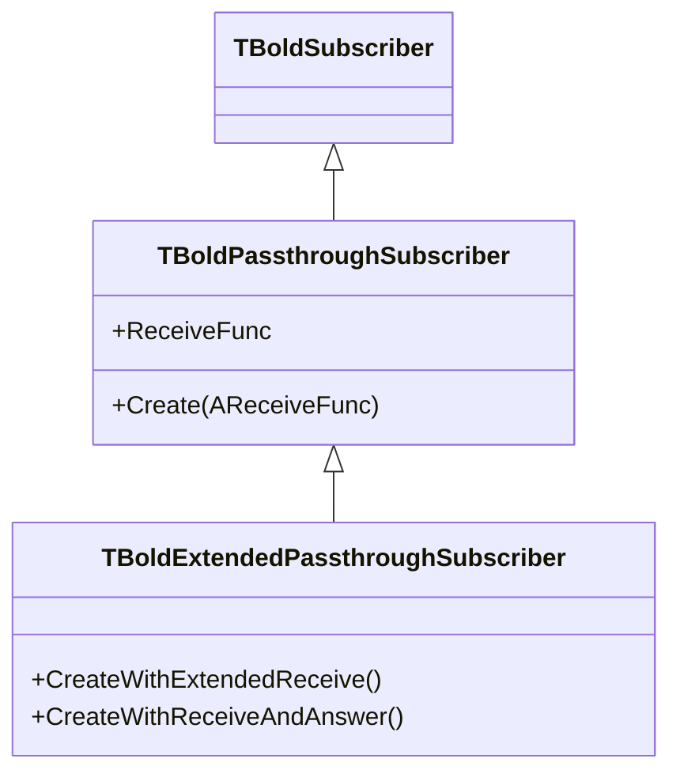

# TBoldPassthroughSubscriber

`TBoldPassthroughSubscriber` is the most commonly used concrete subscriber. It delegates received events to a callback method, making it easy to react to Bold events without creating custom subscriber classes.

## Class Hierarchy



## Class Definition

```pascal
TBoldEventHandler = procedure(Originator: TObject;
  OriginalEvent: TBoldEvent;
  RequestedEvent: TBoldRequestedEvent) of object;

TBoldPassthroughSubscriber = class(TBoldSubscriber)
public
  constructor Create(AReceiveFunc: TBoldEventHandler);
  property ReceiveFunc: TBoldEventHandler read/write;
end;

// Extended version for events with arguments and queries
TBoldExtendedPassthroughSubscriber = class(TBoldPassthroughSubscriber)
public
  constructor CreateWithExtendedReceive(
    AExtendedReceiveFunc: TBoldExtendedEventHandler);
  constructor CreateWithReceiveAndAnswer(
    AReceiveFunc: TBoldEventHandler;
    AAnswerFunc: TBoldQueryHandler);
end;
```

## Working with TBoldPassthroughSubscriber

### Basic Event Handling

```pascal
type
  TMyForm = class(TForm)
  private
    fSubscriber: TBoldPassthroughSubscriber;
    procedure HandleEvent(Originator: TObject;
      OriginalEvent: TBoldEvent;
      RequestedEvent: TBoldRequestedEvent);
  end;

procedure TMyForm.FormCreate(Sender: TObject);
begin
  // Create subscriber with callback
  fSubscriber := TBoldPassthroughSubscriber.Create(HandleEvent);

  // Subscribe to value changes on a specific object
  Customer.M_Name.DefaultSubscribe(fSubscriber);
end;

procedure TMyForm.HandleEvent(Originator: TObject;
  OriginalEvent: TBoldEvent;
  RequestedEvent: TBoldRequestedEvent);
begin
  // React to the change
  UpdateDisplay;
end;

procedure TMyForm.FormDestroy(Sender: TObject);
begin
  fSubscriber.Free; // automatically cancels subscriptions
end;
```

### Subscribing to Multiple Events

```pascal
// Subscribe to specific small events using a set
Customer.AddSmallSubscription(fSubscriber,
  [beValueChanged, beObjectDeleted],
  beValueChanged); // RequestedEvent for routing
```

### Extended Events with Arguments

```pascal
fExtSubscriber := TBoldExtendedPassthroughSubscriber.CreateWithExtendedReceive(
  HandleExtendedEvent);

procedure TMyForm.HandleExtendedEvent(Originator: TObject;
  OriginalEvent: TBoldEvent;
  RequestedEvent: TBoldRequestedEvent;
  const Args: array of const);
begin
  // Args contain additional event data
end;
```

### Query Handling (Veto Pattern)

```pascal
fQuerySubscriber := TBoldExtendedPassthroughSubscriber.CreateWithReceiveAndAnswer(
  HandleEvent, HandleQuery);

function TMyForm.HandleQuery(Originator: TObject;
  OriginalEvent: TBoldEvent;
  RequestedEvent: TBoldRequestedEvent;
  const Args: array of const;
  Subscriber: TBoldSubscriber): Boolean;
begin
  // Return False to veto the operation
  Result := CanPerformOperation;
end;
```

## Subscribable Base Classes

Most Bold objects inherit from a subscribable base class that embeds a `TBoldPublisher`:

| Base Class | Inherits From | Used By |
|------------|---------------|---------|
| `TBoldSubscribableObject` | `TBoldFlaggedObject` | Domain elements, members |
| `TBoldSubscribableComponent` | `TComponent` | Handles, UI components |
| `TBoldSubscribablePersistent` | `TPersistent` | Persistent settings |

These all expose the same convenience methods:

```pascal
AddSubscription(Subscriber, Event, RequestedEvent);
AddSmallSubscription(Subscriber, EventSet, RequestedEvent);
SendEvent(Event);
```

## See Also

- [TBoldSubscriber](TBoldSubscriber.md) - Abstract base
- [TBoldPublisher](TBoldPublisher.md) - The sender side
- [TBoldAbstractDeriver](TBoldAbstractDeriver.md) - Derivation subscriber
- [Subscriptions](../concepts/subscriptions.md) - Concept overview
