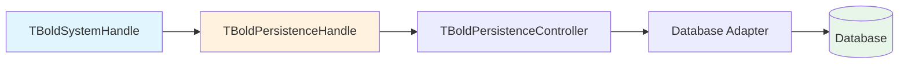

# TBoldPersistenceHandle

`TBoldPersistenceHandle` is the abstract base component that connects Bold's Object Space to a persistence layer (database, XML file, etc.). It acts as the bridge between the in-memory object model and durable storage.

## Class Hierarchy

```mermaid
classDiagram
    TComponent <|-- TBoldSubscribableComponent
    TBoldSubscribableComponent <|-- TBoldHandle
    TBoldHandle <|-- TBoldPersistenceHandle
    TBoldPersistenceHandle <|-- TBoldPersistenceHandleDB
    TBoldPersistenceHandle <|-- TBoldPersistenceHandleFileXML
    TBoldPersistenceHandle <|-- TBoldPersistenceHandlePassthrough

    class TBoldPersistenceHandle {
        +Active Boolean
        +PersistenceController
        #CreatePersistenceController()
    }
    class TBoldPersistenceHandleDB {
        +BoldModel
        +DatabaseAdapter
    }

    click TBoldSystemHandle href "../TBoldSystemHandle/" "TBoldSystemHandle"
```

## Class Definition

```pascal
TBoldPersistenceHandle = class(TBoldHandle)
protected
  function CreatePersistenceController: TBoldPersistenceController; virtual; abstract;
  procedure SetActive(Value: Boolean); virtual;
public
  constructor Create(Owner: TComponent); override;
  destructor Destroy; override;
  procedure ReleasePersistenceController;
  procedure AddPersistenceSubscription(Subscriber: TBoldSubscriber;
    Events: TBoldSmallEventSet = []);
  property Active: Boolean read GetActive write SetActive;
  property PersistenceController: TBoldPersistenceController;
end;
```

## Connection Architecture



The persistence handle follows **lazy initialization**: the `PersistenceController` is created on first access via the abstract `CreatePersistenceController` method.

## Concrete Implementations

| Class | Purpose | Database |
|-------|---------|----------|
| `TBoldPersistenceHandleDB` | SQL database persistence | Any SQL database |
| `TBoldPersistenceHandleFileXML` | XML file persistence | File system |
| `TBoldPersistenceHandlePassthrough` | Chains multiple handles | N/A |

## Working with TBoldPersistenceHandle

### Form Designer Setup (Database)

1. Drop `TBoldPersistenceHandleDB` on a data module
2. Set `BoldModel` to your `TBoldModel` component
3. Set `DatabaseAdapter` to a FireDAC adapter component
4. Connect `TBoldSystemHandle.PersistenceHandle` to this component

### Activation

```pascal
// Activate the persistence connection
PersistenceHandle.Active := True;

// Deactivate (sends beDeactivating, releases controller)
PersistenceHandle.Active := False;
```

### Subscribing to Persistence Events

```pascal
// Monitor persistence operations (fetch, update, etc.)
PersistenceHandle.AddPersistenceSubscription(MySubscriber,
  [bpeStartFetch, bpeEndFetch, bpeStartUpdate, bpeEndUpdate]);
```

### Persistence Event Constants

| Event | Meaning |
|-------|---------|
| `bpeStartFetch` | Fetch operation starting |
| `bpeEndFetch` | Fetch operation complete |
| `bpeStartUpdate` | Database update starting |
| `bpeEndUpdate` | Database update complete |
| `bpeFetchObject` | Single object fetched |
| `bpeUpdateObject` | Single object updated |
| `bpeDeleteObject` | Object deleted from DB |
| `bpeCreateObject` | Object created in DB |

## See Also

- [TBoldSystemHandle](TBoldSystemHandle.md) - References persistence handle
- [TBoldSystem](TBoldSystem.md) - Object Space
- [Persistence](../concepts/persistence.md) - Persistence concepts
