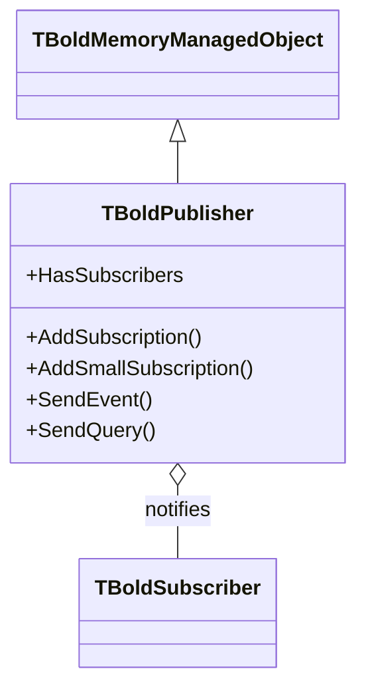
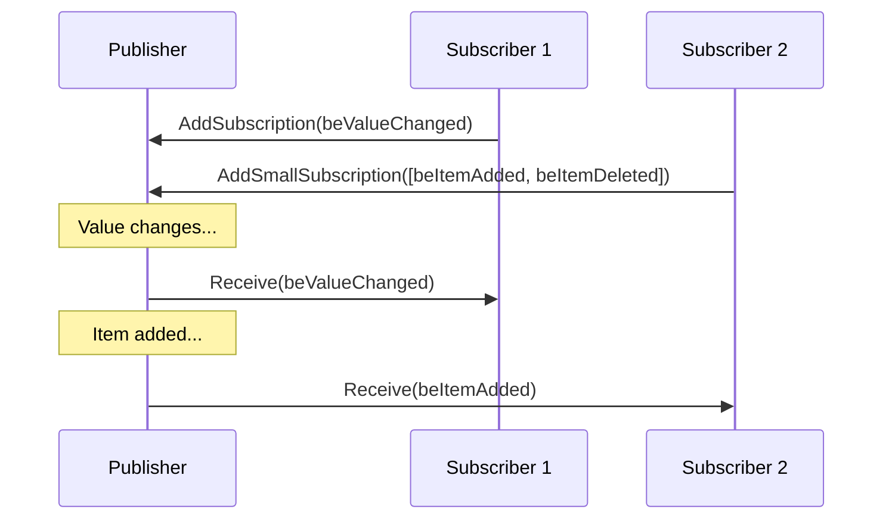

# TBoldPublisher

`TBoldPublisher` is the sender side of Bold's subscription (observer) pattern. It manages a list of subscriptions and dispatches events to registered subscribers.

## Class Hierarchy



## Class Definition

```pascal
TBoldPublisher = class(TBoldMemoryManagedObject)
public
  constructor Create(var APublisherReference);
  destructor Destroy; override;
  procedure AddSubscription(Subscriber: TBoldSubscriber;
    OriginalEvent: TBoldEvent;
    RequestedEvent: TBoldRequestedEvent = beDefaultRequestedEvent);
  procedure AddSmallSubscription(Subscriber: TBoldSubscriber;
    Events: TBoldSmallEventSet;
    RequestedEvent: TBoldRequestedEvent = beDefaultRequestedEvent);
  procedure SendEvent(OriginalEvent: TBoldEvent);
  procedure SendExtendedEvent(Originator: TObject;
    OriginalEvent: TBoldEvent; const Args: array of const);
  function SendQuery(Originator: TObject; OriginalEvent: TBoldEvent;
    const Args: array of const; Subscriber: TBoldSubscriber): Boolean;
  procedure CancelSubscriptionTo(Subscriber: TBoldSubscriber);
  procedure NotifySubscribersAndClearSubscriptions(Originator: TObject);
  property HasSubscribers: Boolean;
  property SubscriptionCount: Integer;
  property SubscriptionsAsText: string; // debug
end;
```

## Event System

Events are integers (`TBoldEvent = 0..100000`). Small events (0–29) can be combined in sets for efficient multi-event subscriptions.

### Core Event Constants

| Event | Value | Meaning |
|-------|-------|---------|
| `beDestroying` | 0 | Object being destroyed |
| `beMemberChanged` | 1 | A member value changed |
| `beObjectDeleted` | 2 | Object was deleted |
| `beObjectCreated` | 3 | New object created |
| `beItemAdded` | 4 | Item added to list |
| `beItemDeleted` | 5 | Item removed from list |
| `beItemReplaced` | 6 | Item replaced in list |
| `beValueChanged` | 8 | Attribute or reference value changed |
| `breReSubscribe` | 10 | Request to resubscribe |
| `beValueInvalid` | 12 | Value marked invalid |

### Event Types

| Method | Purpose |
|--------|---------|
| `SendEvent` | One-way notification — subscribers are informed |
| `SendExtendedEvent` | Notification with additional arguments |
| `SendQuery` | Two-way — subscribers can veto the operation |

## How It Works



## Common Patterns

### Direct Usage (Rare)

Most Bold objects already embed a publisher via `TBoldSubscribableObject` or `TBoldSubscribableComponent`. Direct `TBoldPublisher` creation is rarely needed:

```pascal
var
  fPublisher: TBoldPublisher;

constructor TMyClass.Create;
begin
  fPublisher := TBoldPublisher.Create(fPublisher);
end;

// Send events
fPublisher.SendEvent(beValueChanged);
```

### Subscribable Base Classes

In practice, use the convenience methods from subscribable base classes:

```pascal
// TBoldSubscribableObject provides:
MyObject.AddSubscription(Subscriber, beValueChanged);
MyObject.SendEvent(beValueChanged);

// TBoldSubscribableComponent provides:
MyComponent.AddSmallSubscription(Subscriber, [beItemAdded, beItemDeleted]);
```

## See Also

- [TBoldSubscriber](TBoldSubscriber.md) - The receiver side
- [TBoldPassthroughSubscriber](TBoldPassthroughSubscriber.md) - Concrete subscriber
- [Subscriptions](../concepts/subscriptions.md) - Concept overview
