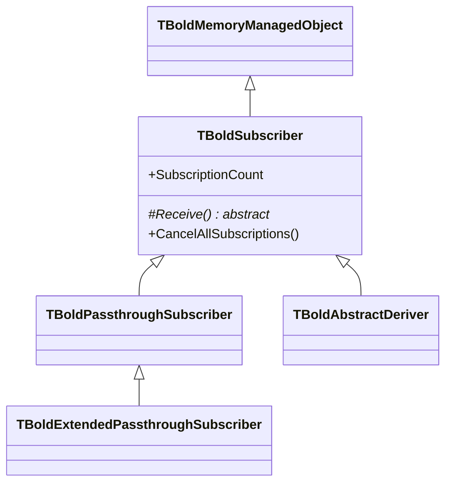
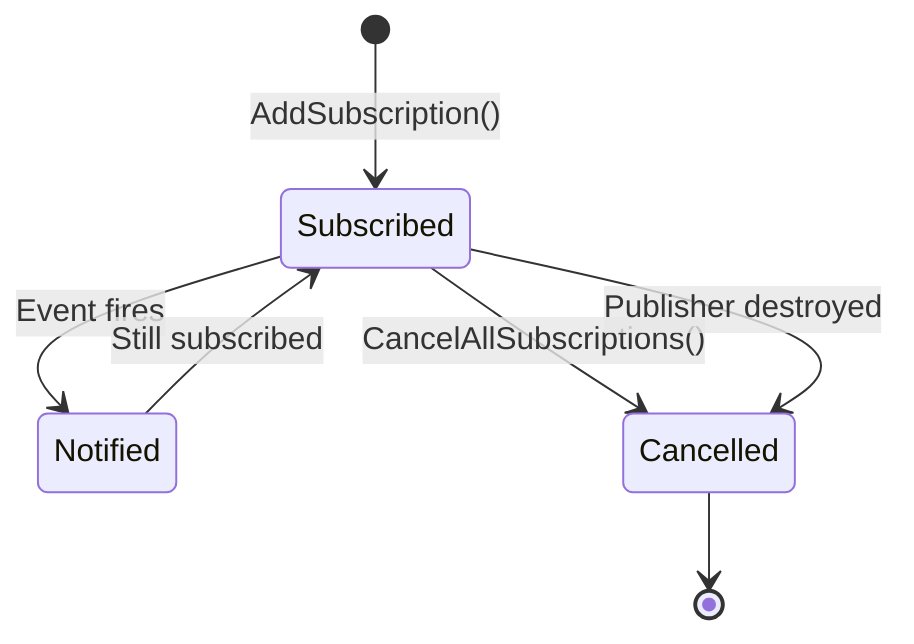

# TBoldSubscriber

`TBoldSubscriber` is the abstract receiver side of Bold's subscription (observer) pattern. It receives events from publishers and manages its subscription registrations.

## Class Hierarchy



## Class Definition

```pascal
TBoldSubscriber = class(TBoldMemoryManagedObject)
protected
  // MUST override in descendants
  procedure Receive(Originator: TObject; OriginalEvent: TBoldEvent;
    RequestedEvent: TBoldRequestedEvent); virtual; abstract;

  // Optional overrides
  procedure ReceiveExtended(Originator: TObject; OriginalEvent: TBoldEvent;
    RequestedEvent: TBoldRequestedEvent; const Args: array of const); virtual;
  function Answer(Originator: TObject; OriginalEvent: TBoldEvent;
    RequestedEvent: TBoldRequestedEvent; const Args: array of const;
    Subscriber: TBoldSubscriber): Boolean; virtual;
public
  procedure CancelAllSubscriptions;
  function HasMatchingSubscription(APublisher: TBoldPublisher): Boolean;
  procedure CancelSubscriptionTo(APublisher: TBoldPublisher);
  property SubscriptionCount: Integer;
  property SubscriptionsAsText: string; // debug
end;
```

## Key Concepts

### Abstract — Use Descendants

`TBoldSubscriber` is abstract. In application code, use one of:

| Class | Use Case |
|-------|----------|
| [TBoldPassthroughSubscriber](TBoldPassthroughSubscriber.md) | Simple event callback delegation |
| [TBoldAbstractDeriver](TBoldAbstractDeriver.md) | Automatic value derivation |
| Custom subclass | Complex subscription logic |

### Receive Method

The `Receive` method is called when a subscribed event fires:

- **Originator** — the object that sent the event
- **OriginalEvent** — the actual event that occurred (e.g., `beValueChanged`)
- **RequestedEvent** — the event you subscribed for (for routing)

### Subscription Lifecycle



Subscriptions are automatically cleaned up when either the publisher or subscriber is destroyed.

## Common Patterns

### Custom Subscriber

```pascal
type
  TMySubscriber = class(TBoldSubscriber)
  protected
    procedure Receive(Originator: TObject; OriginalEvent: TBoldEvent;
      RequestedEvent: TBoldRequestedEvent); override;
  end;

procedure TMySubscriber.Receive(Originator: TObject;
  OriginalEvent: TBoldEvent; RequestedEvent: TBoldRequestedEvent);
begin
  case RequestedEvent of
    beValueChanged: HandleValueChange(Originator);
    beDestroying: HandleDestroyed(Originator);
  end;
end;
```

### Cleanup

```pascal
destructor TMyComponent.Destroy;
begin
  fSubscriber.CancelAllSubscriptions;
  fSubscriber.Free;
  inherited;
end;
```

## See Also

- [TBoldPublisher](TBoldPublisher.md) - The sender side
- [TBoldPassthroughSubscriber](TBoldPassthroughSubscriber.md) - Concrete subscriber
- [TBoldAbstractDeriver](TBoldAbstractDeriver.md) - Derivation subscriber
- [Subscriptions](../concepts/subscriptions.md) - Concept overview
