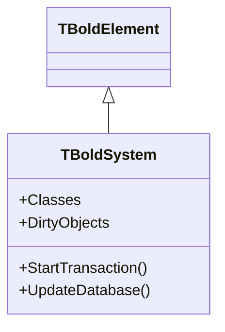

# TBoldSystem

`TBoldSystem` is the central class that manages the **Object Space** - the in-memory graph of all domain objects.

## Class Definition

```pascal
TBoldSystem = class(TBoldElement)
public
  // Class management
  property Classes[const AClassName: string]: TBoldClassExtent;
  property ClassCount: Integer;

  // Object management
  property DirtyObjects: TBoldObjectList;
  property ObjectById[const Id: TBoldObjectId]: TBoldObject;

  // Transactions
  procedure StartTransaction;
  procedure CommitTransaction;
  procedure RollbackTransaction;
  property InTransaction: Boolean;

  // Persistence
  procedure UpdateDatabase;
  procedure FetchObject(AObject: TBoldObject);

  // OCL evaluation
  function EvaluateExpression(const Expression: string;
    Context: TBoldElement): TBoldElement;
  function EvaluateExpressionAsNewElement(const Expression: string;
    Context: TBoldElement): TBoldElement;
end;
```

## Inheritance



## Properties

### Classes

Access class extents by name:

```pascal
var
  CustomerExtent: TBoldClassExtent;
begin
  CustomerExtent := BoldSystem.Classes['Customer'];
  ShowMessage(Format('%d customers', [CustomerExtent.BoldObjects.Count]));
end;
```

### DirtyObjects

List of objects with unsaved changes:

```pascal
if BoldSystem.DirtyObjects.Count > 0 then
begin
  if MessageDlg('Save changes?', mtConfirmation, [mbYes, mbNo], 0) = mrYes then
    BoldSystem.UpdateDatabase;
end;
```

### ObjectById

Find object by its persistent ID:

```pascal
var
  Customer: TBoldObject;
  Id: TBoldObjectId;
begin
  Id := TBoldDefaultId.CreateWithClassIdAndId(CustomerClassId, 42);
  Customer := BoldSystem.ObjectById[Id];
end;
```

## Methods

### StartTransaction / CommitTransaction / RollbackTransaction

Wrap modifications in a transaction:

```pascal
BoldSystem.StartTransaction;
try
  Customer.Name := 'Updated';
  Order.Delete;
  BoldSystem.CommitTransaction;
except
  BoldSystem.RollbackTransaction;
  raise;
end;
```

### UpdateDatabase

Persist all dirty objects to database:

```pascal
BoldSystem.UpdateDatabase;
```

### EvaluateExpression

Execute OCL query:

```pascal
var
  ActiveCustomers: TBoldObjectList;
begin
  ActiveCustomers := BoldSystem.EvaluateExpressionAsNewElement(
    'Customer.allInstances->select(active = true)',
    nil
  ) as TBoldObjectList;
end;
```

## Common Usage

### Getting the System

```pascal
// From a handle
var System: TBoldSystem := BoldSystemHandle1.System;

// From an object
var System: TBoldSystem := SomeObject.BoldSystem;
```

### Creating Objects

```pascal
var
  Customer: TCustomer;
begin
  Customer := BoldSystem.Classes['Customer'].CreateNewObject as TCustomer;
  // or
  Customer := TCustomer.Create(BoldSystem);
end;
```

### Iterating All Objects of a Class

```pascal
var
  Extent: TBoldClassExtent;
  i: Integer;
begin
  Extent := BoldSystem.Classes['Customer'];
  for i := 0 to Extent.BoldObjects.Count - 1 do
    ProcessCustomer(Extent.BoldObjects[i] as TCustomer);
end;
```

## Events

| Event | Description |
|-------|-------------|
| `OnPreUpdate` | Before saving to database |
| `OnPostUpdate` | After saving to database |

## See Also

- [TBoldObject](TBoldObject.md) - Individual domain objects
- [Object Space Concept](../concepts/object-space.md) - Detailed explanation
