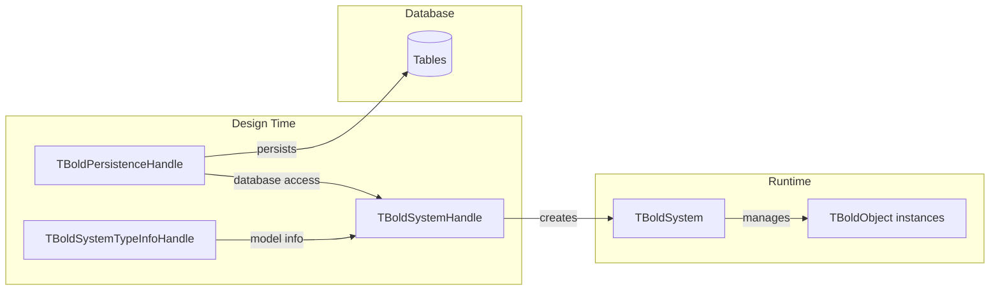
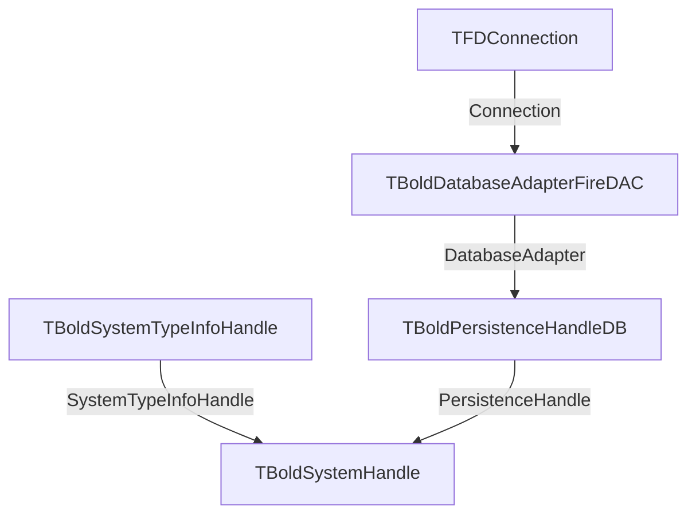

# TBoldSystemHandle

`TBoldSystemHandle` is the main component that manages the connection between your application and the Bold Object Space. It creates and manages the `TBoldSystem` instance.

## Class Definition

```pascal
TBoldSystemHandle = class(TBoldAbstractSystemHandle)
public
  // Core access
  property System: TBoldSystem;
  property Active: Boolean;

  // Database operations
  procedure UpdateDatabase;
  procedure Discard;

  // Configuration
  property AutoActivate: Boolean;
  property Persistent: Boolean;
  property PersistenceHandle: TBoldPersistenceHandle;
  property SystemTypeInfoHandle: TBoldSystemTypeInfoHandle;

  // Events
  property OnPreUpdate: TNotifyEvent;
  property OnOptimisticLockingFailed: TBoldOptimisticLockingFailedEvent;
end;
```

## Component Diagram



## Properties

### System

Access the underlying TBoldSystem:

```pascal
var
  BoldSystem: TBoldSystem;
begin
  BoldSystem := BoldSystemHandle1.System;
  // Work with objects
end;
```

### Active

Enable or disable the Object Space:

```pascal
// Activate manually
BoldSystemHandle1.Active := True;

// Check status
if BoldSystemHandle1.Active then
  ShowMessage('System is active');
```

### AutoActivate

When True, automatically activates when the application starts:

```pascal
// Set at design time or before form creation
BoldSystemHandle1.AutoActivate := True;
```

### PersistenceHandle

Links to the persistence layer for database operations:

```pascal
// Connect to database persistence
BoldSystemHandle1.PersistenceHandle := BoldPersistenceHandleDB1;
```

### SystemTypeInfoHandle

Links to the model information (generated from UML):

```pascal
// Connect to model info
BoldSystemHandle1.SystemTypeInfoHandle := BoldSystemTypeInfoHandle1;
```

## Methods

### UpdateDatabase

Save all dirty objects to the database:

```pascal
// Save changes
BoldSystemHandle1.UpdateDatabase;
```

### Discard

Discard all unsaved changes:

```pascal
// Revert to database state
BoldSystemHandle1.Discard;
```

## Events

### OnPreUpdate

Fired before saving to database:

```pascal
procedure TForm1.BoldSystemHandle1PreUpdate(Sender: TObject);
begin
  // Validate before save
  ValidateAllChanges;
end;
```

### OnOptimisticLockingFailed

Fired when concurrent modification is detected:

```pascal
procedure TForm1.BoldSystemHandle1OptimisticLockingFailed(
  Sender: TObject; FailedObjects: TBoldObjectList);
begin
  ShowMessage('Another user modified these objects');
  // Handle conflict
end;
```

## Typical Setup

### Design-Time Configuration

1. Drop `TBoldSystemHandle` on a data module
2. Drop `TBoldSystemTypeInfoHandle` and link to your model
3. Drop `TBoldPersistenceHandleDB` and configure database
4. Connect the components



### Runtime Activation

```pascal
procedure TDataModule1.DataModuleCreate(Sender: TObject);
begin
  // Configure connection
  FDConnection1.Params.Database := 'MyDatabase.db';

  // Activate the system
  BoldSystemHandle1.Active := True;
end;
```

## Common Patterns

### Check for Unsaved Changes

```pascal
function HasUnsavedChanges: Boolean;
begin
  Result := BoldSystemHandle1.System.DirtyObjects.Count > 0;
end;
```

### Save with Confirmation

```pascal
procedure SaveChanges;
begin
  if HasUnsavedChanges then
  begin
    if MessageDlg('Save changes?', mtConfirmation, [mbYes, mbNo], 0) = mrYes then
      BoldSystemHandle1.UpdateDatabase
    else
      BoldSystemHandle1.Discard;
  end;
end;
```

### Graceful Shutdown

```pascal
procedure TDataModule1.DataModuleDestroy(Sender: TObject);
begin
  if BoldSystemHandle1.Active then
  begin
    SaveChanges;
    BoldSystemHandle1.Active := False;
  end;
end;
```

## See Also

- [TBoldSystem](TBoldSystem.md) - The Object Space
- [TBoldListHandle](TBoldListHandle.md) - List queries
- [Persistence](../concepts/persistence.md) - Database mapping
