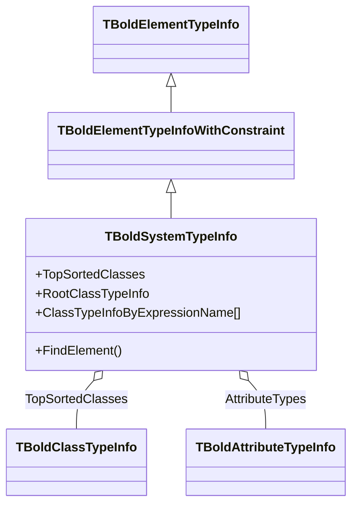

# TBoldSystemTypeInfo

`TBoldSystemTypeInfo` provides runtime type information for the entire Bold model. It is the central registry for looking up class types, attribute types, list types, and other model metadata at runtime.

## Class Hierarchy



## Class Definition

```pascal
TBoldSystemTypeInfo = class(TBoldElementTypeInfoWithConstraint)
public
  // Class lookup
  property TopSortedClasses: TBoldClassTypeInfoList;
  property RootClassTypeInfo: TBoldClassTypeInfo;
  property ClassTypeInfoByExpressionName[const name: string]: TBoldClassTypeInfo;
  property ClassTypeInfoByModelName[const name: string]: TBoldClassTypeInfo;
  property ClassTypeInfoByClass[ObjectClass: TClass]: TBoldClassTypeInfo;

  // Attribute type lookup
  property AttributeTypes: TBoldAttributeTypeInfoList;
  property AttributeTypeInfoByExpressionName[const name: string]: TBoldAttributeTypeInfo;
  property AttributeTypeInfoByDelphiName[const name: string]: TBoldAttributeTypeInfo;

  // General lookup
  property ElementTypeInfoByExpressionName[const name: string]: TBoldElementTypeInfo;
  property ElementTypeInfoByDelphiName[const name: string]: TBoldElementTypeInfo;
  property MemberTypeInfoByQualifiedName[const AClassName, AMemberName: string]: TBoldMemberRTInfo;
  property ListTypeInfoByElement[Element: TBoldElementTypeInfo]: TBoldListTypeInfo;
  function FindElement(const AText: string;
    ASearchOptions: TBoldTypeInfoSearchOptions;
    ASearchTypes: TBoldSearchTypes): TBoldMetaElement;

  // List types
  property ListTypes: TBoldListTypeInfoList;
  property UntypedListTypeInfo: TBoldListTypeInfo;

  // Special types
  property NilTypeInfo: TBoldNilTypeInfo;
  property TypeTypeInfo: TBoldTypeTypeInfo;
  property ValueSetTypeInfo: TBoldElementTypeInfo;

  // System properties
  property Persistent: Boolean;
  property UseGeneratedCode: Boolean;
  property OptimisticLocking: TBoldOptimisticLockingMode;
  property ModelCRC: string;
  property UseClockLog: Boolean;
  property MethodsInstalled: Boolean;
end;
```

## Accessing SystemTypeInfo

```pascal
// Via TBoldSystem
var SystemTypeInfo: TBoldSystemTypeInfo;
SystemTypeInfo := BoldSystem.BoldSystemTypeInfo;
```

## Working with TBoldSystemTypeInfo

### Iterating All Classes

```pascal
var
  ClassInfo: TBoldClassTypeInfo;
begin
  for ClassInfo in SystemTypeInfo.TopSortedClasses do
  begin
    Log(Format('Class: %s (persistent=%s, abstract=%s)',
      [ClassInfo.ExpressionName,
       BoolToStr(ClassInfo.Persistent, True),
       BoolToStr(ClassInfo.IsAbstract, True)]));
  end;
end;
```

### Looking Up a Class

```pascal
// By OCL expression name
var CustomerInfo: TBoldClassTypeInfo;
CustomerInfo := SystemTypeInfo.ClassTypeInfoByExpressionName['Customer'];

// By Delphi class
CustomerInfo := SystemTypeInfo.ClassTypeInfoByClass[TCustomer];

// By UML model name
CustomerInfo := SystemTypeInfo.ClassTypeInfoByModelName['Customer'];
```

### Finding Member Info

```pascal
var MemberInfo: TBoldMemberRTInfo;
MemberInfo := SystemTypeInfo.MemberTypeInfoByQualifiedName['Customer', 'name'];
if MemberInfo.IsDerived then
  Log('name is a derived attribute');
```

### Search Across All Types

```pascal
// Partial match search across classes, attributes, roles
var Found: TBoldMetaElement;
Found := SystemTypeInfo.FindElement('Cust', [soPartialMatch], [stClass]);
// Returns TBoldClassTypeInfo for 'Customer'
```

### Model Versioning

```pascal
// Check model CRC for compatibility
Log('Model CRC: ' + SystemTypeInfo.ModelCRC);
```

## See Also

- [TBoldClassTypeInfo](TBoldClassTypeInfo.md) - Per-class type info
- [TBoldMemberRTInfo](TBoldMemberRTInfo.md) - Per-member type info
- [TBoldSystem](TBoldSystem.md) - Object Space
