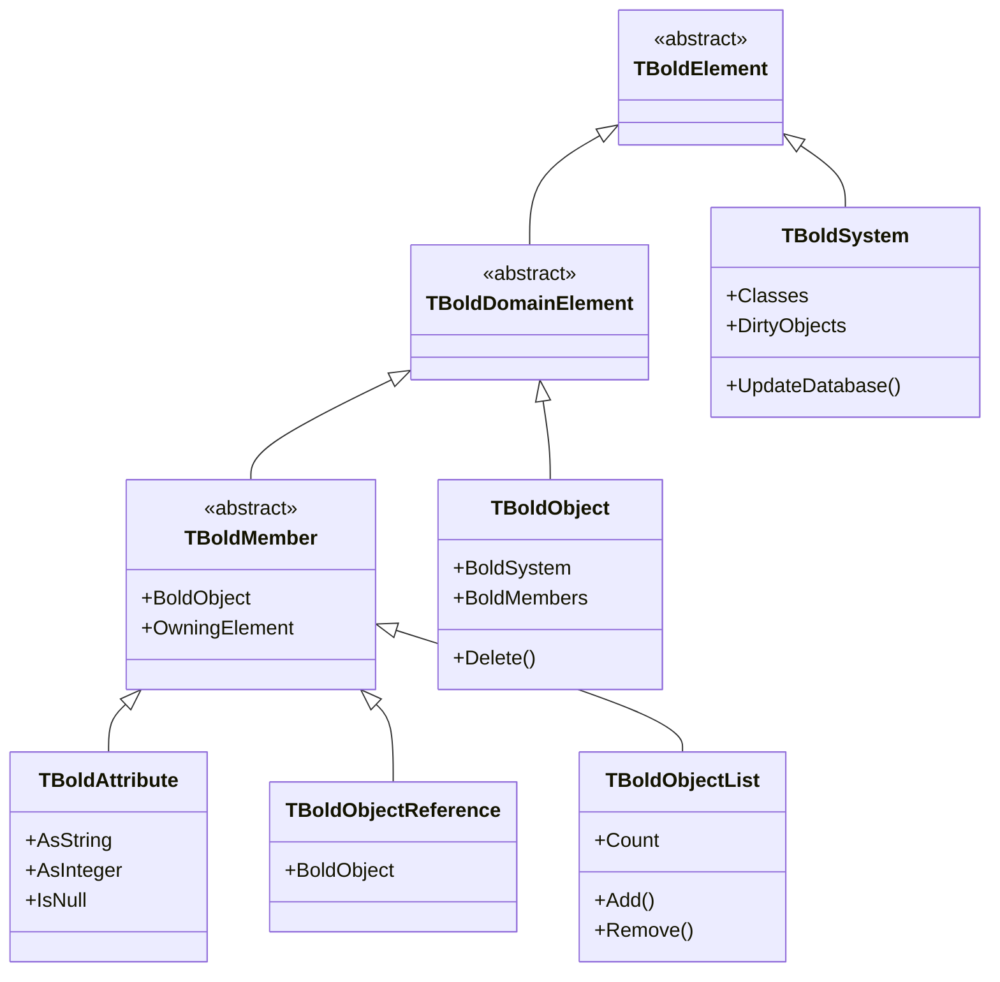
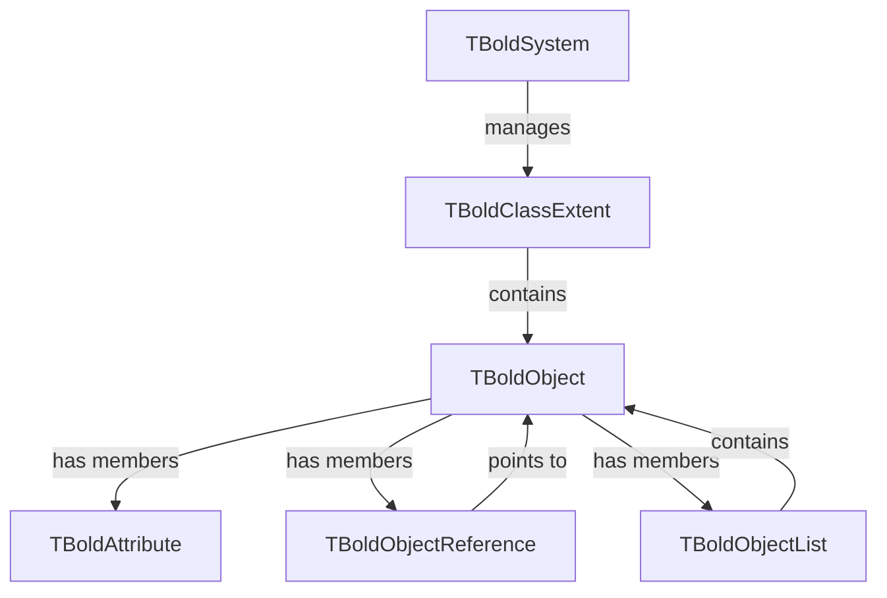

# Class Reference

This section documents the most important classes in Bold for Delphi.

## Class Hierarchy



## Core Classes

| Class | Description | Documentation |
|-------|-------------|---------------|
| [TBoldSystem](TBoldSystem.md) | The Object Space - manages all objects | Core |
| [TBoldObject](TBoldObject.md) | Base class for all domain objects | Core |
| [TBoldObjectList](TBoldObjectList.md) | Collection of Bold objects | Core |
| [TBoldMember](TBoldMember.md) | Base class for attributes and references | Core |
| [TBoldAttribute](TBoldAttribute.md) | Stores attribute values | Core |

## Relationship Between Classes



## Common Patterns

### Accessing Objects

```pascal
// From system
var System: TBoldSystem := BoldSystemHandle1.System;

// Get all instances of a class
var Customers: TBoldObjectList := System.Classes['Customer'].BoldObjects;

// Navigate from object
var Orders: TBoldObjectList := Customer.Orders;
```

### Modifying Objects

```pascal
// Change attribute
Customer.Name := 'New Name';

// Add to list
Customer.Orders.Add(NewOrder);

// Delete object
Customer.Delete;
```

### Querying Objects

```pascal
// OCL query
var Result: TBoldObjectList := System.EvaluateExpressionAsNewElement(
  'Customer.allInstances->select(active)',
  nil
) as TBoldObjectList;
```
