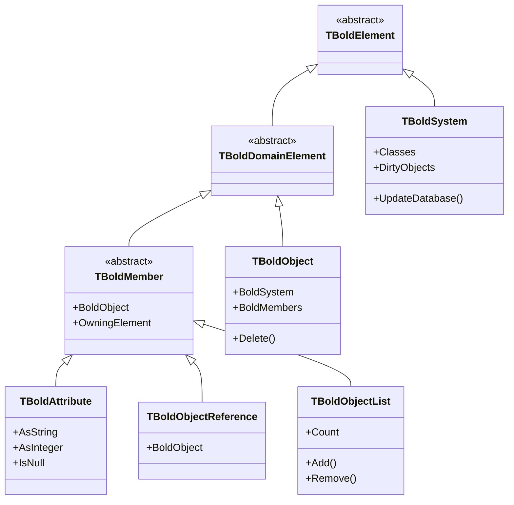
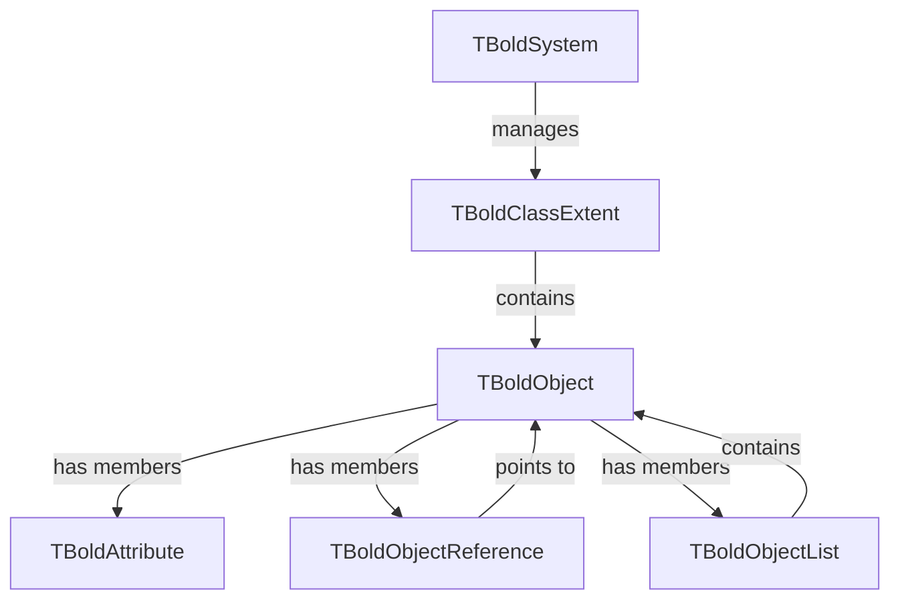

# Class Reference

This section documents the most important classes in Bold for Delphi.

## Class Hierarchy


```mermaid
classDiagram
    class TBoldElement {
        <<abstract>>
    }

    class TBoldDomainElement {
        <<abstract>>
    }

    class TBoldMember {
        <<abstract>>
        +BoldObject
        +OwningElement
    }

    class TBoldAttribute {
        +AsString
        +AsInteger
        +IsNull
    }

    class TBoldObjectReference {
        +BoldObject
    }

    class TBoldObjectList {
        +Count
        +Add()
        +Remove()
    }

    class TBoldObject {
        +BoldSystem
        +BoldMembers
        +Delete()
    }

    class TBoldSystem {
        +Classes
        +DirtyObjects
        +UpdateDatabase()
    }

    TBoldElement <|-- TBoldDomainElement
    TBoldDomainElement <|-- TBoldMember
    TBoldDomainElement <|-- TBoldObject
    TBoldMember <|-- TBoldAttribute
    TBoldMember <|-- TBoldObjectReference
    TBoldMember <|-- TBoldObjectList
    TBoldElement <|-- TBoldSystem

    click TBoldElement href "TBoldElement/" "TBoldElement documentation"
    click TBoldSystem href "TBoldSystem/" "TBoldSystem documentation"
    click TBoldObject href "TBoldObject/" "TBoldObject documentation"
    click TBoldObjectList href "TBoldObjectList/" "TBoldObjectList documentation"
    click TBoldMember href "TBoldMember/" "TBoldMember documentation"
    click TBoldAttribute href "TBoldAttribute/" "TBoldAttribute documentation"
    click TBoldObjectReference href "TBoldObjectReference/" "TBoldObjectReference documentation"
```

## Core Classes

| Class | Description |
|-------|-------------|
| [TBoldElement](TBoldElement.md) | Abstract base class for all Bold elements |
| [TBoldSystem](TBoldSystem.md) | The Object Space - manages all objects |
| [TBoldObject](TBoldObject.md) | Base class for all domain objects |
| [TBoldObjectList](TBoldObjectList.md) | Collection of Bold objects |
| [TBoldMember](TBoldMember.md) | Base class for attributes and references |
| [TBoldAttribute](TBoldAttribute.md) | Stores attribute values |
| [TBoldObjectReference](TBoldObjectReference.md) | Single-valued associations |

## Attribute Types

| Class | Description |
|-------|-------------|
| [TBAString](TBAString.md) | String attributes (Unicode, ANSI, trimmed, text) |
| [TBAInteger](TBAInteger.md) | Integer attributes (Integer, SmallInt, Word, Byte) |
| [TBAFloat](TBAFloat.md) | Double floating-point attributes |
| [TBACurrency](TBACurrency.md) | Fixed-point currency attributes |
| [TBAMoment](TBAMoment.md) | Date/time attributes (DateTime, Date, Time) |
| [TBABoolean](TBABoolean.md) | Boolean attributes |
| [TBABlob](TBABlob.md) | Binary large object attributes |

## Handle Classes

| Class | Description |
|-------|-------------|
| [TBoldSystemHandle](TBoldSystemHandle.md) | Manages the Object Space connection |
| [TBoldListHandle](TBoldListHandle.md) | OCL list expressions with filtering and sorting |
| [TBoldExpressionHandle](TBoldExpressionHandle.md) | Single value OCL expressions |
| [TBoldPersistenceHandle](TBoldPersistenceHandle.md) | Connects Object Space to database |

## Subscription & Derivation

| Class | Description |
|-------|-------------|
| [TBoldPublisher](TBoldPublisher.md) | Event sender — manages subscriptions |
| [TBoldSubscriber](TBoldSubscriber.md) | Event receiver — abstract base |
| [TBoldPassthroughSubscriber](TBoldPassthroughSubscriber.md) | Delegates events to callback methods |
| [TBoldAbstractDeriver](TBoldAbstractDeriver.md) | Automatic value derivation engine |

## Runtime Type Info

| Class | Description |
|-------|-------------|
| [TBoldSystemTypeInfo](TBoldSystemTypeInfo.md) | Model-wide type registry |
| [TBoldClassTypeInfo](TBoldClassTypeInfo.md) | Per-class metadata (members, hierarchy) |
| [TBoldMemberRTInfo](TBoldMemberRTInfo.md) | Per-member metadata (type, persistence, derivation) |

## GUI Components

| Class | Description |
|-------|-------------|
| [TBoldGrid](TBoldGrid.md) | Data-aware grid for object lists |
| [TBoldEdit](TBoldEdit.md) | Data-aware text edit |
| [TBoldLabel](TBoldLabel.md) | Data-aware read-only label |
| [TBoldComboBox](TBoldComboBox.md) | Data-aware combo box with lookup |
| [TBoldCheckBox](TBoldCheckBox.md) | Data-aware boolean checkbox |

## Utilities

| Class | Description |
|-------|-------------|
| [TBoldGuard](TBoldGuard.md) | Automatic memory management via interface ref counting |
| [TBoldObjectId](TBoldObjectId.md) | Object identity for persistence |

## Relationship Between Classes


```mermaid
flowchart TB
    System[TBoldSystem]
    ClassExtent[TBoldClassExtent]
    Object[TBoldObject]
    Attribute[TBoldAttribute]
    Reference[TBoldObjectReference]
    List[TBoldObjectList]

    System -->|"manages"| ClassExtent
    ClassExtent -->|"contains"| Object
    Object -->|"has members"| Attribute
    Object -->|"has members"| Reference
    Object -->|"has members"| List
    Reference -->|"points to"| Object
    List -->|"contains"| Object

    click System href "TBoldSystem/" "TBoldSystem documentation"
    click Object href "TBoldObject/" "TBoldObject documentation"
    click Attribute href "TBoldAttribute/" "TBoldAttribute documentation"
    click Reference href "TBoldObjectReference/" "TBoldObjectReference documentation"
    click List href "TBoldObjectList/" "TBoldObjectList documentation"
```

## Common Patterns

### Accessing Objects

```pascal
// From system
var System: TBoldSystem := BoldSystemHandle1.System;

// Get all instances of a class
var Customers: TBoldObjectList := System.Classes['Customer'].BoldObjects;

// Navigate from object
var Orders: TBoldObjectList := Customer.Orders;
```

### Modifying Objects

```pascal
// Change attribute
Customer.Name := 'New Name';

// Add to list
Customer.Orders.Add(NewOrder);

// Delete object
Customer.Delete;
```

### Querying Objects

```pascal
// OCL query
var Result: TBoldObjectList := System.EvaluateExpressionAsNewElement(
  'Customer.allInstances->select(active)',
  nil
) as TBoldObjectList;
```
