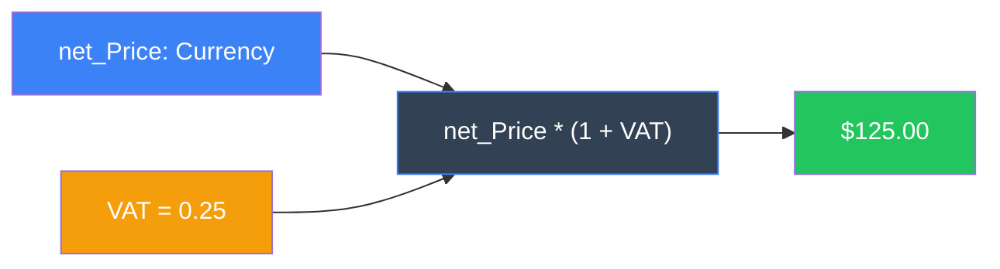

# Derived Attributes

**Automatic calculation of dependent values using OCL**

## Overview

A derived attribute is a value calculated from other values, eliminating the need for persistence since it can always be recomputed. Common examples include invoice totals, full names from first/last name, or age calculated from birth date.

This example demonstrates **code-free** derived attributes using OCL expressions defined directly in the model.

## Key Concepts

| Concept | Description |
|---------|-------------|
| **OCL Expressions** | Define derivation logic in the model using Object Constraint Language |
| **Automatic Updates** | Derived values recalculate automatically when dependencies change |
| **Write Protection** | Derived attributes are read-only - change the source values instead |
| **OCL Variables** | Use global variables within OCL expressions for dynamic calculations |

## How It Works

Derived attributes automatically recalculate when their dependencies change:



**Example Calculation:** `$100 × (1 + 0.25) = $125.00`

## How to Run the Example

1. Add products using the grid and enter net prices
2. Observe the **Retail Price** column - it's calculated automatically
3. Change the **VAT** value at the bottom - watch retail prices update
4. Try editing the Retail Price directly - it's write-protected
5. Change Net Price - the Retail Price updates automatically

## Implementation

The `retail_Price` attribute in the `Product` class is derived using an OCL expression that references the `net_Price` attribute and a global VAT variable.

This approach requires **zero code** - the derivation logic is entirely defined in the model, making it easy to modify and maintain.

---

## Step-by-Step: Adding a Derived Attribute

This workflow demonstrates adding a `ProjectDuration` attribute to a `Process` class that calculates days between `StartDate` and `EndDate`.

### Video Walkthrough

<video controls preload="metadata" style="max-width: 100%; border-radius: 8px;">
  <source src="../../assets/videos/derived-workflow.webm" type="video/webm">
  <source src="../../assets/videos/derived-workflow.mp4" type="video/mp4">
  Your browser does not support the video tag.
</video>

*Complete workflow: Adding a derived attribute in the Model Editor*

### 1. Open the Model Editor

Double-click on the `BoldModel1` component in your form or datamodule. The Bold Model Editor opens.

### 2. Navigate to the Class

In the class tree, find and select the target class (e.g., `Process`).

### 3. Add New Attribute

Right-click on the class attributes section and select **Add Attribute**, or use the toolbar button.

### 4. Configure the Attribute Properties

| Property | Value | Description |
|----------|-------|-------------|
| **Name** | `ProjectDuration` | Attribute name |
| **Type** | `Integer` | Return type of the calculation |
| **Derived** | `True` | Mark as derived (calculated) |
| **Persistent** | `False` | Not stored in database |
| **DelayedDerive** | `False` | Recalculate immediately when dependencies change |

### 5. Set the DerivationOCL Expression

Enter the OCL expression that calculates the value:

```ocl
if (self.StartDate.isNull or self.EndDate.isNull) then nil else (self.EndDate - self.StartDate).round endif
```

!!! info "OCL Expression Explained"

    - `self.StartDate.isNull` - Check if StartDate has no value
    - `self.EndDate - self.StartDate` - Date subtraction returns days as float
    - `.round` - Convert float to integer (rounds to nearest)
    - `nil` - Return null when dates are missing

### 6. Save and Regenerate Code

Save the model and regenerate `BusinessClasses.pas`. The derived attribute is now ready to use.

### Behavior

=== "Transient (In-Memory)"

    When `StartDate` or `EndDate` changes, `ProjectDuration` automatically recalculates. UI components bound to it update immediately.

=== "Database"

    With `Persistent=False`, the value is not stored. It's calculated on demand when the object is loaded. For persistent derived attributes, set `Persistent=True`.

## Related Topics

- [OCL Queries](ocl.md) - Full OCL reference
- [Object Space](object-space.md) - Understanding the in-memory object model

## Project Files

:material-file-code: **Location:** `examples/Simple/ObjectSpace/DerivedAttributes/`

- `BE_DerivedAttribDemo.dpr` - Main project file
