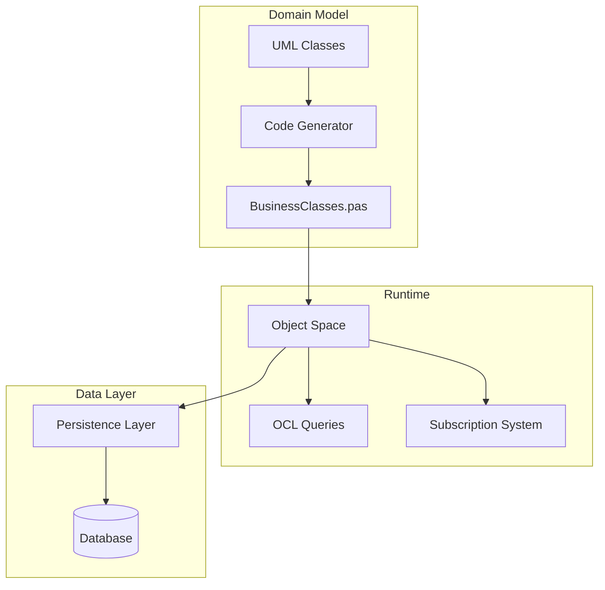

# Core Concepts

Bold for Delphi is built on several fundamental concepts that work together to provide a complete MDA framework.

## Concept Map

## Key Concepts

| Concept | Description | Learn More |
|---------|-------------|------------|
| **Object Space** | In-memory graph of all domain objects | [Object Space](object-space.md) |
| **OCL** | Query language for navigating and filtering objects | [OCL Queries](ocl.md) |
| **Persistence** | Automatic object-relational mapping | [Persistence](persistence.md) |
| **Subscriptions** | Observer pattern for reactive updates | [Subscriptions](subscriptions.md) |

## The Bold Workflow

1. **Design** - Create UML model with classes, attributes, and associations
2. **Generate** - Bold generates Delphi code from the model
3. **Develop** - Write business logic using generated classes
4. **Run** - Objects live in Object Space, persist to database
5. **React** - UI automatically updates via subscriptions
