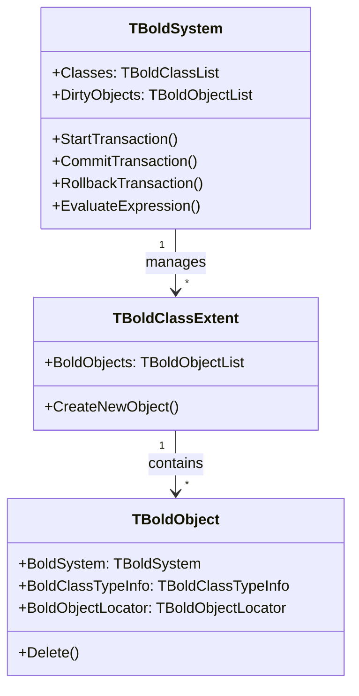
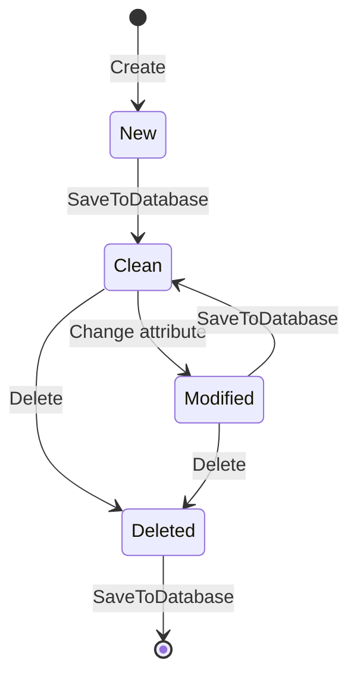

# Object Space

The **Object Space** is Bold's in-memory object graph where all domain objects live during runtime. It's managed by `TBoldSystem` and provides:

- Object lifecycle management (create, modify, delete)
- Identity management (each object has a unique ID)
- Change tracking (dirty objects, undo/redo)
- Transaction support

## Architecture



## Object States

Objects in the Object Space have a state that tracks their lifecycle:



| State | Description |
|-------|-------------|
| **New** | Just created, not yet in database |
| **Clean** | Matches database, no pending changes |
| **Modified** | Has unsaved changes |
| **Deleted** | Marked for deletion |

## Working with Object Space

### Accessing the System

```pascal
var
  System: TBoldSystem;
begin
  System := BoldSystemHandle1.System;
end;
```

### Creating Objects

```pascal
var
  Customer: TCustomer;
begin
  // Method 1: Using class extent
  Customer := System.Classes['Customer'].CreateNewObject as TCustomer;

  // Method 2: Direct constructor (if generated)
  Customer := TCustomer.Create(System);
end;
```

### Finding Objects

```pascal
// Get all instances of a class
var
  AllCustomers: TBoldObjectList;
begin
  AllCustomers := System.Classes['Customer'].BoldObjects;
end;

// Find by ID
var
  Customer: TBoldObject;
begin
  Customer := System.ObjectById[SomeId];
end;
```

### Transactions

```pascal
System.StartTransaction;
try
  // Make changes
  Customer.Name := 'New Name';
  Order.Delete;

  System.CommitTransaction;
except
  System.RollbackTransaction;
  raise;
end;
```

## Class Extents

Each class in your model has a **Class Extent** - a collection of all instances of that class:

```pascal
var
  CustomerExtent: TBoldClassExtent;
  Count: Integer;
begin
  CustomerExtent := System.Classes['Customer'];
  Count := CustomerExtent.BoldObjects.Count;
end;
```

## Dirty Objects

Bold tracks which objects have unsaved changes:

```pascal
// Check if there are unsaved changes
if System.DirtyObjects.Count > 0 then
  ShowMessage('You have unsaved changes');

// Get list of modified objects
for i := 0 to System.DirtyObjects.Count - 1 do
  ProcessDirtyObject(System.DirtyObjects[i]);
```
