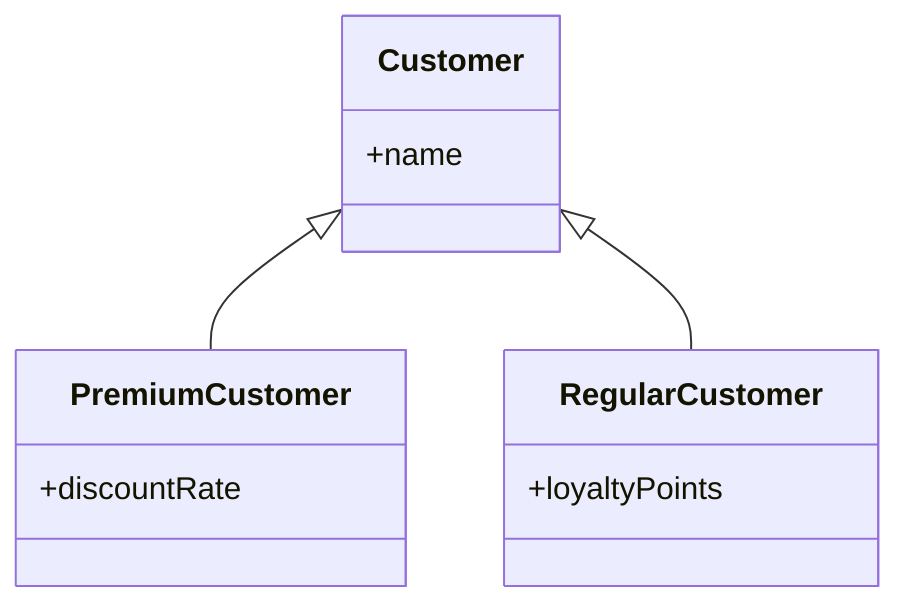

# OCL Queries

**OCL (Object Constraint Language)** is a powerful query language for navigating and filtering objects in Bold. It's based on the OMG standard and provides a declarative way to express complex queries.

## Basic Syntax

### Getting All Instances

```ocl
Customer.allInstances
```

### Navigating Associations

```ocl
self.orders                    // One customer's orders
self.orders.orderLines         // All order lines from all orders
```

### Filtering with Select

```ocl
Customer.allInstances->select(age > 30)
Customer.allInstances->select(name = 'Acme')
```

### Checking Existence

```ocl
Customer.allInstances->select(orders->notEmpty)
Customer.allInstances->exists(totalPurchases > 10000)
```

## Common Operations

### Collection Operations

| Operation | Type | Description | Example |
|-----------|------|-------------|---------|
| `->select(expr)` | Collection | Filter elements | `orders->select(total > 100)` |
| `->reject(expr)` | Collection | Exclude elements | `orders->reject(cancelled)` |
| `->collect(expr)` | Collection | Transform elements | `orders->collect(total)` |
| `->exists(expr)` | Boolean | Any match? | `orders->exists(total > 1000)` |
| `->forAll(expr)` | Boolean | All match? | `orders->forAll(paid)` |
| `->isEmpty` | Boolean | Collection empty? | `orders->isEmpty` |
| `->notEmpty` | Boolean | Collection has items? | `orders->notEmpty` |
| `->size` | Integer | Count elements | `orders->size` |
| `->first` | Element | First element | `orders->first` |
| `->last` | Element | Last element | `orders->last` |
| `->at(n)` | Element | Element at index | `orders->at(0)` |
| `->includes(x)` | Boolean | Contains element? | `orders->includes(anOrder)` |

### Aggregation

```ocl
orders->collect(total)->sum      // Sum of all totals
orders->collect(total)->avg      // Average
orders->collect(total)->max      // Maximum
orders->collect(total)->min      // Minimum
```

### Sorting

```ocl
Customer.allInstances->orderBy(name)
Customer.allInstances->orderDescending(createdDate)
```

### Type Operations

#### Class Hierarchy Example



#### Type Checking Operations

```ocl
self.oclIsKindOf(Customer)       // True for Customer, PremiumCustomer, RegularCustomer
self.oclIsTypeOf(Customer)       // True only for exact Customer type
self.oclAsType(PremiumCustomer)  // Cast to PremiumCustomer type
```

## Using OCL in Delphi

### Evaluate Expression

```pascal
var
  Result: TBoldElement;
  Customers: TBoldObjectList;
begin
  Result := BoldSystem.EvaluateExpressionAsNewElement(
    'Customer.allInstances->select(orders->size > 5)',
    nil  // context object (self)
  );
  Customers := Result as TBoldObjectList;
end;
```

### With Context Object

```pascal
var
  Customer: TCustomer;
  OrderCount: Integer;
begin
  // 'self' refers to Customer
  OrderCount := BoldSystem.EvaluateExpressionAsInteger(
    'self.orders->size',
    Customer
  );
end;
```

### In Bold Handles

```pascal
// TBoldListHandle - for lists of objects
BoldListHandle1.Expression := 'Customer.allInstances->select(active)';

// TBoldExpressionHandle - for single values
BoldExpressionHandle1.Expression := 'self.orders->collect(total)->sum';
```

See [TBoldListHandle](../classes/TBoldListHandle.md) and [TBoldExpressionHandle](../classes/TBoldExpressionHandle.md) for more details.

## Advanced Examples

### Complex Filtering

```ocl
// Customers with at least one order over $1000 this year
Customer.allInstances->select(
  orders->exists(
    (total > 1000) and
    (orderDate.year = 2024)
  )
)
```

**Note:** `Customer` (uppercase) refers to the class/metatype, while `orders` (lowercase) is a navigation property on the current object. In OCL, `Customer.allInstances` accesses all instances of the Customer class, whereas `self.orders` navigates from the current object to its related orders.

### Nested Navigation

```ocl
// All products ordered by premium customers
Customer.allInstances
  ->select(oclIsKindOf(PremiumCustomer))
  ->collect(orders)
  ->collect(orderLines)
  ->collect(product)
  ->asSet
```

### Conditional Logic

```ocl
// If-then-else
if self.orders->isEmpty then
  'No orders'
else
  self.orders->size.toString + ' orders'
endif
```
