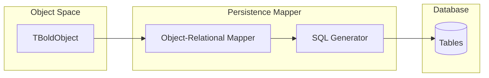

# Persistence

Bold provides transparent **Object-Relational Mapping (ORM)** that automatically persists your domain objects to a relational database.

## Architecture



## Mapping Rules

### Classes to Tables

| UML Element | Database Element |
|-------------|-----------------|
| Class | Table |
| Attribute | Column |
| Association (1:N) | Foreign Key |
| Association (N:M) | Link Table |
| Inheritance | Type discriminator column |

### Example Mapping

```
UML Model                    Database Schema
───────────                  ───────────────
┌─────────────┐              ┌─────────────────────────┐
│  Customer   │              │ CUSTOMER                │
├─────────────┤              ├─────────────────────────┤
│ Name: String│  ────────►   │ BOLD_ID      INT PK     │
│ Email:String│              │ BOLD_TYPE    INT        │
└─────────────┘              │ NAME         VARCHAR    │
                             │ EMAIL        VARCHAR    │
                             └─────────────────────────┘
```

## Configuration

### Database Adapter Setup

```pascal
// FireDAC adapter (recommended)
BoldDatabaseAdapterFireDAC1.Connection := FDConnection1;
BoldPersistenceHandleDB1.DatabaseAdapter := BoldDatabaseAdapterFireDAC1;
```

### Supported Databases

| Database | Adapter |
|----------|---------|
| SQL Server | FireDAC, UniDAC |
| PostgreSQL | FireDAC, UniDAC |
| InterBase | FireDAC |
| Oracle | FireDAC, UniDAC |
| SQLite | FireDAC |

## Operations

### Save Changes

```pascal
// Save all dirty objects to database
BoldSystemHandle1.UpdateDatabase;

// Or via system
BoldSystemHandle1.System.UpdateDatabase;
```

### Fetch Objects

Bold fetches objects lazily by default:

```pascal
// Objects loaded on first access
Customer := Customers[0];  // Fetches from DB if not loaded
Name := Customer.Name;     // Attribute already loaded
```

### Batch Fetching

For performance, prefetch related objects:

```pascal
// Fetch customers and their orders in one query
BoldSystemHandle1.System.FetchLinksWithObjects(
  CustomerList,
  'orders'
);
```

## Transactions

### Basic Transaction

```pascal
BoldSystem.StartTransaction;
try
  // Create, modify, delete objects
  Customer.Name := 'Updated';
  Order.Delete;

  BoldSystem.CommitTransaction;
  BoldSystem.UpdateDatabase;
except
  BoldSystem.RollbackTransaction;
  raise;
end;
```

### Nested Transactions

Bold supports nested transactions with savepoints.

## Schema Evolution

Bold can evolve your database schema when the model changes:

```pascal
// Use DbEvolutor to generate migration scripts
BoldDbEvolutor1.GenerateScript;
```

Changes handled:
- Add/remove classes (tables)
- Add/remove attributes (columns)
- Modify attribute types
- Add/remove associations

## Performance Tips

1. **Use batch fetching** for collections you'll iterate
2. **Avoid N+1 queries** by prefetching associations
3. **Use OCL efficiently** - filter in database when possible
4. **Index foreign keys** for faster association traversal
