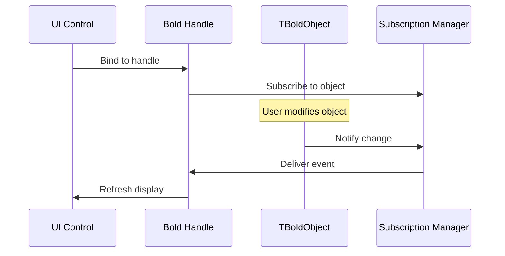
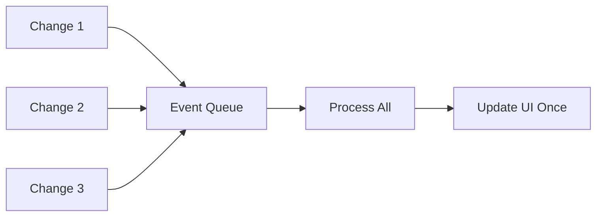

# Subscriptions

Bold uses a **Subscription System** (observer pattern) to automatically notify interested parties when objects change. This enables reactive UI updates without manual refresh code.

## How It Works



## Subscription Events

| Event | Description |
|-------|-------------|
| `beValueChanged` | Attribute value changed |
| `beObjectCreated` | New object created |
| `beObjectDeleted` | Object deleted |
| `beItemAdded` | Item added to list |
| `beItemRemoved` | Item removed from list |
| `beMemberChanged` | Any member changed |

## Automatic Subscriptions

Bold handles and controls automatically subscribe to relevant objects:

```pascal
// TBoldEdit automatically subscribes to the bound attribute
BoldEdit1.BoldHandle := CustomerHandle;
BoldEdit1.BoldProperties.Expression := 'name';
// Edit updates automatically when Customer.Name changes
```

## Manual Subscriptions

For custom logic, subscribe directly:

```pascal
type
  TMyForm = class(TForm)
  private
    FSubscriber: TBoldPassthroughSubscriber;
    procedure ObjectChanged(Originator: TObject;
      OriginalEvent, RequestedEvent: TBoldEvent);
  end;

procedure TMyForm.FormCreate(Sender: TObject);
begin
  FSubscriber := TBoldPassthroughSubscriber.Create(ObjectChanged);

  // Subscribe to a specific object
  Customer.AddSubscription(FSubscriber, beValueChanged);
end;

procedure TMyForm.ObjectChanged(Originator: TObject;
  OriginalEvent, RequestedEvent: TBoldEvent);
begin
  // React to change
  UpdateCustomerDisplay;
end;

procedure TMyForm.FormDestroy(Sender: TObject);
begin
  FSubscriber.Free;
end;
```

## Derivers

**Derivers** automatically recalculate values when dependencies change:

```pascal
// In UML model, mark attribute as derived
// Bold generates deriver code

procedure TOrder._TotalDeriveAndSubscribe(DerivedObject: TObject;
  Subscriber: TBoldSubscriber);
var
  Total: Currency;
  Line: TOrderLine;
begin
  Total := 0;
  for Line in OrderLines do
  begin
    // Subscribe to each line's subtotal
    Line.M_Subtotal.DefaultSubscribe(Subscriber);
    Total := Total + Line.Subtotal;
  end;
  M_Total.AsFloat := Total;
end;
```

When any `OrderLine.Subtotal` changes, `Order.Total` automatically recalculates.

## Event Queue

Bold batches subscription notifications for efficiency:



### Manual Queue Control

```pascal
// Pause notifications during batch updates
BoldSystem.StartTransaction;
try
  // Many changes, no notifications yet
  for i := 0 to 1000 do
    Items[i].Value := NewValue;

  BoldSystem.CommitTransaction;
  // All notifications sent now
except
  BoldSystem.RollbackTransaction;
end;
```

## Best Practices

1. **Let Bold handle subscriptions** - Use handles and controls when possible
2. **Clean up manual subscriptions** - Always free subscribers in `OnDestroy`
3. **Avoid circular dependencies** - Can cause infinite recalculation loops
4. **Use transactions** - Batch changes to minimize notification overhead
