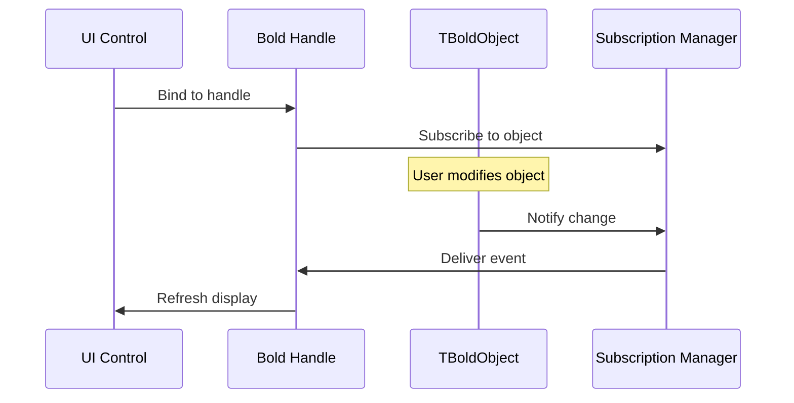
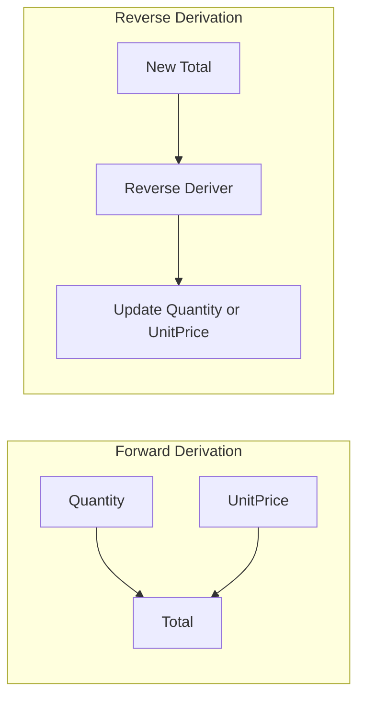
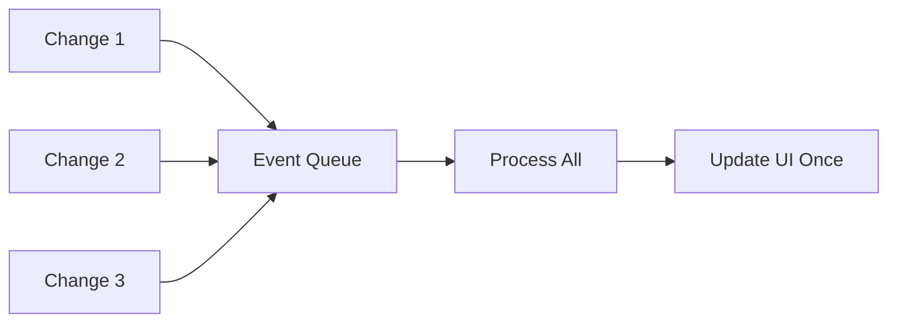

# Subscriptions

Bold uses a **Subscription System** (observer pattern) to automatically notify interested parties when objects change. This enables reactive UI updates without manual refresh code.

## How It Works


```mermaid
sequenceDiagram
    participant UI as UI Control
    participant Handle as Bold Handle
    participant Object as TBoldObject
    participant Sub as Subscription Manager

    UI->>Handle: Bind to handle
    Handle->>Sub: Subscribe to object
    Note over Object: User modifies object
    Object->>Sub: Notify change
    Sub->>Handle: Deliver event
    Handle->>UI: Refresh display
```

## Subscription Events

| Event | Description |
|-------|-------------|
| `beValueChanged` | Attribute value changed |
| `beObjectCreated` | New object created |
| `beObjectDeleted` | Object deleted |
| `beItemAdded` | Item added to list |
| `beItemRemoved` | Item removed from list |
| `beMemberChanged` | Any member changed |

## Automatic Subscriptions

Bold handles and controls automatically subscribe to relevant objects:

```pascal
// TBoldEdit automatically subscribes to the bound attribute
BoldEdit1.BoldHandle := CustomerHandle;
BoldEdit1.BoldProperties.Expression := 'name';
// Edit updates automatically when Customer.Name changes
```

## Manual Subscriptions

For custom logic, subscribe directly:

```pascal
type
  TMyForm = class(TForm)
  private
    FSubscriber: TBoldPassthroughSubscriber;
    procedure ObjectChanged(Originator: TObject;
      OriginalEvent, RequestedEvent: TBoldEvent);
  end;

procedure TMyForm.FormCreate(Sender: TObject);
begin
  FSubscriber := TBoldPassthroughSubscriber.Create(ObjectChanged);

  // Subscribe to a specific object
  Customer.AddSubscription(FSubscriber, beValueChanged);
end;

procedure TMyForm.ObjectChanged(Originator: TObject;
  OriginalEvent, RequestedEvent: TBoldEvent);
begin
  // React to change
  UpdateCustomerDisplay;
end;

procedure TMyForm.FormDestroy(Sender: TObject);
begin
  FSubscriber.Free;
end;
```

## Derivers

**Derivers** automatically recalculate values when dependencies change. In the UML model, mark a member as "derived" and choose how to implement the derivation logic.

### Two Ways to Implement Derivers

You can implement derivation using **OCL expressions** or **Delphi code**:

#### OCL Expression (Declarative)

Define the derivation directly in the UML model using OCL:

```
// In UML model, set the derivation expression for Order.Total:
orderLines.subTotal->sum
```

#### Delphi Code (Procedural)

Bold generates a `_DeriveAndSubscribe` method that you implement in code:

```pascal
procedure TOrder._TotalDeriveAndSubscribe(DerivedObject: TObject;
  Subscriber: TBoldSubscriber);
```

### Comparison: OCL vs Delphi Code

| Aspect | OCL Expression | Delphi Code |
|--------|----------------|-------------|
| **Simplicity** | Simple expressions are concise | Any complexity supported |
| **Subscriptions** | Automatic | Automatic (can also add manual) |
| **Debugging** | Harder to debug | Full debugger support |
| **Performance** | Can evaluate in database | Always in memory |
| **Flexibility** | Limited to OCL capabilities | Full Delphi power |
| **Maintainability** | Visible in model | Scattered in code |

### When to Use Each Approach

**Use OCL when:**

- The derivation is a simple calculation or navigation
- You want automatic subscription management
- The expression can benefit from database evaluation
- You want the logic visible in the UML model

```
// Good OCL candidates:
orderLines->size                           // Count
orderLines.amount->sum                     // Sum
orders->select(status = 'Active')          // Filter
customer.orders->notEmpty                  // Boolean check
```

**Use Delphi code when:**

- Complex business logic is required
- You need conditional logic or loops
- External services or APIs are involved
- You need full debugging capabilities
- Performance optimization is critical

```pascal
// Good Delphi code candidates:
// - Multi-step calculations with intermediate variables
// - Logic involving external data or services
// - Complex date/time calculations
// - Algorithms that OCL cannot express
```

### What Can Be Derived

| Member Type | Example | Use Case |
|-------------|---------|----------|
| **Attribute** | `Order.Total` | Calculated values |
| **Single Link** | `Person.Employer` | Derived references |
| **Multi Link** | `Customer.ActiveOrders` | Filtered/computed collections |

### Derived Attributes

The most common case - a calculated value based on other attributes:

```pascal
// UML: Order.Total is marked as derived
// Bold generates the method signature, you implement the body

procedure TOrder._TotalDeriveAndSubscribe(DerivedObject: TObject;
  Subscriber: TBoldSubscriber);
var
  Total: Currency;
  Line: TOrderLine;
begin
  Total := 0;
  for Line in OrderLines do
  begin
    // Subscribe to dependencies - when these change, Total recalculates
    Line.M_Subtotal.DefaultSubscribe(Subscriber);
    Total := Total + Line.Subtotal;
  end;
  M_Total.AsFloat := Total;
end;
```

When any `OrderLine.Subtotal` changes, `Order.Total` automatically recalculates.

### Derived Single Links

A reference to another object that is computed, not stored:

```pascal
// UML: Person.Employer is marked as derived
// Returns the company where this person has an active employment

procedure TPerson._EmployerDeriveAndSubscribe(DerivedObject: TObject;
  Subscriber: TBoldSubscriber);
var
  Employment: TEmployment;
begin
  // Subscribe to the employments list
  M_Employments.DefaultSubscribe(Subscriber);

  for Employment in Employments do
  begin
    // Subscribe to each employment's active status
    Employment.M_Active.DefaultSubscribe(Subscriber);

    if Employment.Active then
    begin
      M_Employer.BoldObject := Employment.Company;
      Exit;
    end;
  end;

  // No active employment found
  M_Employer.BoldObject := nil;
end;
```

### Derived Multi Links

A collection that is computed from other data:

```pascal
// UML: Customer.ActiveOrders is marked as derived
// Returns only orders that are not completed or cancelled

procedure TCustomer._ActiveOrdersDeriveAndSubscribe(DerivedObject: TObject;
  Subscriber: TBoldSubscriber);
var
  Order: TOrder;
begin
  // Subscribe to the main orders list
  M_Orders.DefaultSubscribe(Subscriber);

  // Clear and rebuild the derived list
  M_ActiveOrders.Clear;

  for Order in Orders do
  begin
    // Subscribe to each order's status
    Order.M_Status.DefaultSubscribe(Subscriber);

    if not (Order.Status in ['Completed', 'Cancelled']) then
      M_ActiveOrders.Add(Order);
  end;
end;
```

## Reverse Derivation

**Reverse derivation** allows a derived attribute to be set by the user. When the derived value is assigned, Bold calls a reverse deriver to update the underlying source values.

### How Reverse Derivation Works


```mermaid
flowchart LR
    subgraph Forward["Forward Derivation"]
        Source1[Quantity] --> Derived[Total]
        Source2[UnitPrice] --> Derived
    end

    subgraph Reverse["Reverse Derivation"]
        NewValue[New Total] --> ReverseDeriver[Reverse Deriver]
        ReverseDeriver --> UpdateSource[Update Quantity or UnitPrice]
    end
```

### Reverse Derivation Example

Consider an order line where `Total = Quantity * UnitPrice`. If the user edits Total directly, the reverse deriver decides how to distribute the change:

```pascal
// UML: OrderLine.Total is marked as derived with reverse derivation enabled

// Forward derivation - calculate Total from Quantity and UnitPrice
procedure TOrderLine._TotalDeriveAndSubscribe(DerivedObject: TObject;
  Subscriber: TBoldSubscriber);
begin
  M_Quantity.DefaultSubscribe(Subscriber);
  M_UnitPrice.DefaultSubscribe(Subscriber);

  M_Total.AsFloat := Quantity * UnitPrice;
end;

// Reverse derivation - when user sets Total, adjust Quantity
procedure TOrderLine._TotalReverseDeriveAndSubscribe(DerivedObject: TObject;
  Subscriber: TBoldSubscriber);
var
  NewTotal: Currency;
begin
  NewTotal := M_Total.AsFloat;

  // Strategy: Keep UnitPrice fixed, adjust Quantity
  if UnitPrice > 0 then
    M_Quantity.AsInteger := Round(NewTotal / UnitPrice)
  else
    M_Quantity.AsInteger := 0;
end;
```

### Another Reverse Derivation Example

A person's full name derived from first and last name, with reverse derivation to parse input:

```pascal
// Forward: FullName = FirstName + ' ' + LastName
procedure TPerson._FullNameDeriveAndSubscribe(DerivedObject: TObject;
  Subscriber: TBoldSubscriber);
begin
  M_FirstName.DefaultSubscribe(Subscriber);
  M_LastName.DefaultSubscribe(Subscriber);

  M_FullName.AsString := FirstName + ' ' + LastName;
end;

// Reverse: Parse FullName into FirstName and LastName
procedure TPerson._FullNameReverseDeriveAndSubscribe(DerivedObject: TObject;
  Subscriber: TBoldSubscriber);
var
  Parts: TArray<string>;
  FullName: string;
begin
  FullName := M_FullName.AsString;
  Parts := FullName.Split([' '], 2);

  if Length(Parts) >= 1 then
    M_FirstName.AsString := Parts[0];
  if Length(Parts) >= 2 then
    M_LastName.AsString := Parts[1]
  else
    M_LastName.AsString := '';
end;
```

### When to Use Reverse Derivation

| Scenario | Example |
|----------|---------|
| **Editable calculated fields** | User can edit Total or Quantity |
| **Composite values** | Full name ↔ First/Last name |
| **Unit conversions** | Celsius ↔ Fahrenheit |
| **Percentage allocations** | Adjust one item, rebalance others |

### Important Considerations

1. **Consistency** - Ensure forward and reverse derivation are logically consistent
2. **Ambiguity** - When multiple sources exist, decide which one to update
3. **Validation** - Validate input in the reverse deriver before applying
4. **Avoid loops** - Be careful not to trigger infinite derivation cycles

## Event Queue

Bold batches subscription notifications for efficiency:


```mermaid
flowchart LR
    Change1[Change 1] --> Queue[Event Queue]
    Change2[Change 2] --> Queue
    Change3[Change 3] --> Queue
    Queue --> Process[Process All]
    Process --> UI[Update UI Once]
```

### Manual Queue Control

```pascal
// Pause notifications during batch updates
BoldSystem.StartTransaction;
try
  // Many changes, no notifications yet
  for i := 0 to 1000 do
    Items[i].Value := NewValue;

  BoldSystem.CommitTransaction;
  // All notifications sent now
except
  BoldSystem.RollbackTransaction;
end;
```

## Best Practices

1. **Let Bold handle subscriptions** - Use handles and controls when possible
2. **Clean up manual subscriptions** - Always free subscribers in `OnDestroy`
3. **Avoid circular dependencies** - Can cause infinite recalculation loops
4. **Use transactions** - Batch changes to minimize notification overhead
