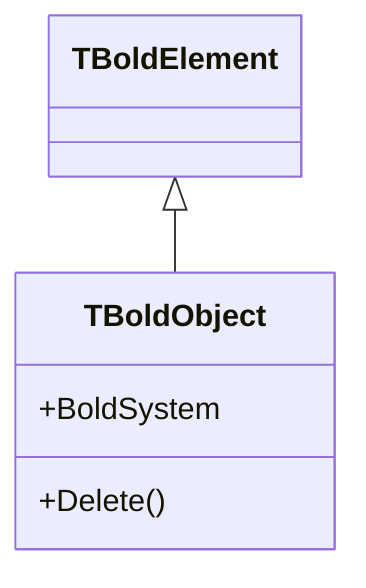

# Contributing to Documentation

This guide explains how to contribute to the Bold for Delphi documentation.

## Prerequisites

- Python 3.x installed
- Git

## Setup

### Install MkDocs

```bash
pip install mkdocs mkdocs-material mkdocs-mermaid2-plugin
```

### Clone the Repository

```bash
git clone https://github.com/bero/BoldForDelphi.git
cd BoldForDelphi
```

## Local Development

### Start Local Server

```bash
python -m mkdocs serve
```

Open **http://127.0.0.1:8000/BoldForDelphi/** in your browser.

The server auto-reloads when you save changes.

### Build Static Site

```bash
python -m mkdocs build
```

Output is generated in the `site/` folder.

## Documentation Structure

```
docs/
├── index.md                  # Home page
├── faq.md                    # Frequently asked questions
├── contributing.md           # This file
├── getting-started/
│   ├── index.md              # Introduction
│   ├── installation.md       # Installation guide
│   └── first-app.md          # Tutorial
├── concepts/
│   ├── index.md              # Concepts overview
│   ├── object-space.md       # Object Space
│   ├── ocl.md                # OCL queries
│   ├── persistence.md        # Database persistence
│   └── subscriptions.md      # Subscription system
└── classes/
    ├── index.md              # Class hierarchy
    ├── TBoldSystem.md
    ├── TBoldObject.md
    ├── TBoldObjectList.md
    ├── TBoldMember.md
    └── TBoldAttribute.md
```

## Adding New Pages

### 1. Create the Markdown File

Create a new `.md` file in the appropriate folder:

```bash
docs/concepts/new-topic.md
```

### 2. Add to Navigation

Edit `mkdocs.yml` and add the page to the `nav` section:

```yaml
nav:
  - Concepts:
    - Overview: concepts/index.md
    - New Topic: concepts/new-topic.md  # Add here
```

### 3. Preview and Commit

```bash
python -m mkdocs serve  # Preview
git add docs/concepts/new-topic.md mkdocs.yml
git commit -m "Add documentation for new topic"
```

## Markdown Features

### Code Blocks

````markdown
```pascal
var
  Customer: TCustomer;
begin
  Customer := TCustomer.Create(BoldSystem);
end;
```
````

### Admonitions

```markdown
!!! note
    This is a note.

!!! warning
    This is a warning.

!!! tip
    This is a tip.
```

Renders as:

!!! note
    This is a note.

!!! warning
    This is a warning.

### Mermaid Diagrams

````markdown

````

Renders as:


### Tables

```markdown
| Column 1 | Column 2 |
|----------|----------|
| Value 1  | Value 2  |
```

### Links

```markdown
[Link to another page](../concepts/ocl.md)
[External link](https://github.com/bero/BoldForDelphi)
```

### Images

Place images in `docs/images/` and reference them:

```markdown


*Caption below the image*
```

From subfolders, use relative path:

```markdown

```

## Deployment

Documentation is automatically deployed to GitHub Pages when changes are pushed to the `master` branch.

**Live site:** [https://bero.github.io/BoldForDelphi/](https://bero.github.io/BoldForDelphi/)

The deployment workflow is defined in `.github/workflows/docs.yml`.

## Style Guide

- Use clear, concise language
- Include code examples for all concepts
- Add diagrams for complex relationships
- Keep pages focused on one topic
- Link to related pages
- Use Pascal code blocks with `pascal` language tag
