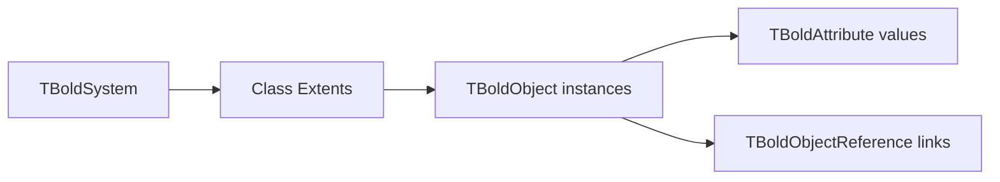

# Introduction to Bold for Delphi

Bold for Delphi is a powerful framework that implements Model-Driven Architecture (MDA) principles. It allows you to design your application's domain model in UML and automatically generates the corresponding Delphi code.

## What is Model-Driven Architecture?

MDA separates business logic from platform-specific implementation details:

1. **Platform-Independent Model (PIM)** - Your UML domain model
2. **Platform-Specific Model (PSM)** - Generated Delphi code
3. **Runtime** - Object Space with persistence

## Core Components

### Object Space
The Object Space is Bold's in-memory object graph. All domain objects live here during runtime.

### Persistence Layer
Bold automatically maps your objects to database tables:

| UML Concept | Database Mapping |
|-------------|-----------------|
| Class | Table |
| Attribute | Column |
| Association | Foreign Key / Link Table |
| Inheritance | Type Column + Subtype Tables |

### Subscription System
Bold uses an observer pattern for automatic updates:

- Objects notify subscribers when they change
- UI controls automatically refresh
- Derived values recalculate automatically

## Next Steps

- [Installation](installation.md) - Set up Bold in your Delphi IDE
- [First Application](first-app.md) - Build your first Bold application
