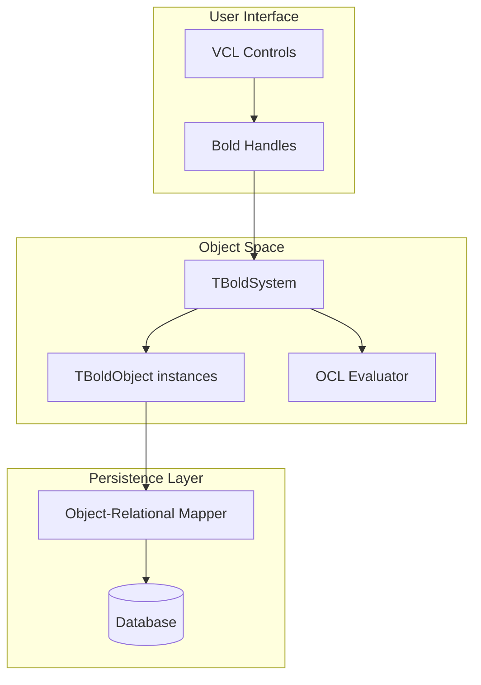

# Bold for Delphi

**Bold for Delphi** is a Model-Driven Architecture (MDA) framework and Object-Relational Mapping (ORM) tool for Delphi. It enables UML-based model development with OCL (Object Constraint Language) queries, automatic code generation, and sophisticated database persistence.

## Key Features

- **UML Model Editor** - Design your domain model visually
- **Code Generation** - Automatically generate Delphi classes from UML models
- **Object Space** - In-memory object graph with full lifecycle management
- **OCL Queries** - Powerful query language for filtering and navigating objects
- **Database Persistence** - Transparent object-relational mapping
- **Subscription System** - Automatic UI updates when objects change

## Architecture Overview



## Quick Start

```pascal
// Get all customers with orders over $1000
var
  Customers: TBoldObjectList;
begin
  Customers := BoldSystem.EvaluateExpressionAsNewElement(
    'Customer.allInstances->select(orders->exists(total > 1000))',
    nil
  ) as TBoldObjectList;
end;
```

## Version

**Current Version**: 26.1.0 (community-maintained)

**Supported Delphi Versions**: 11.3, 12.1, 12.3, 13

## Resources

- [GitHub Repository](https://github.com/ArtDabbler/BoldForDelphi)
- [Bold for Delphi Wiki](https://delphi.fandom.com/wiki/Bold_for_Delphi)
- [Bold Blog](http://boldfordelphi.blogspot.com/)
- [Discord Community](https://discord.gg/C6frzsn)
