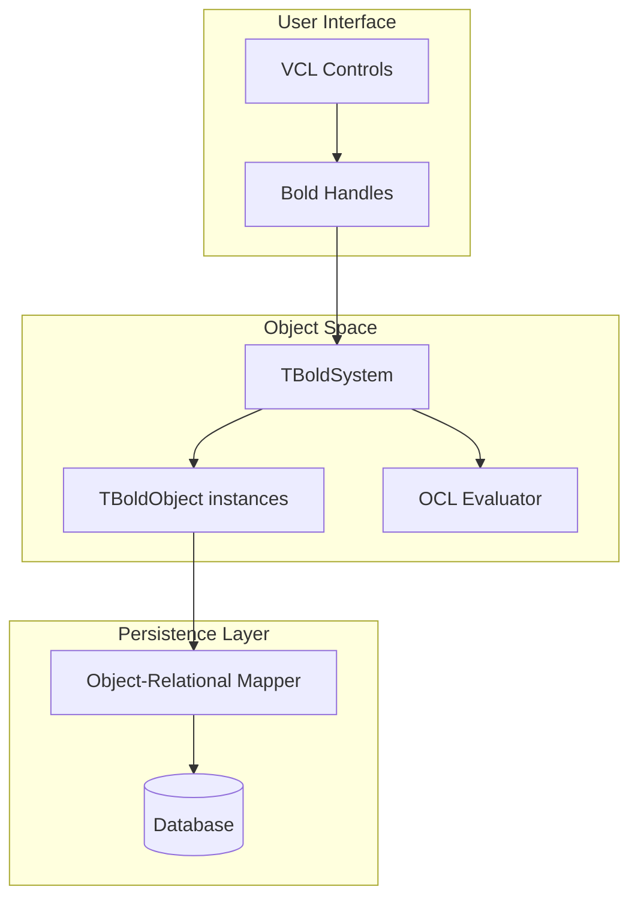

# Bold for Delphi

**Bold for Delphi** is a Model-Driven Architecture (MDA) framework and Object-Relational Mapping (ORM) tool for Delphi. It enables UML-based model development with OCL (Object Constraint Language) queries, automatic code generation, and sophisticated database persistence.

## What can I use it for?

Use Bold when your application is really about a business domain with many related classes, and you want to write that domain once as a model instead of three times: as tables, as DataSets and as forms.

You draw or declare a UML class model: Customer, Order, OrderLine, Product, with attributes and associations. Bold generates the Delphi classes from it, creates and evolves the database schema for it, loads and saves objects for you, and lets you bind VCL controls straight to objects and object lists. Your code works with `Customer.Orders` and `Order.Total`, never with SQL, `TDataSet` or field names.

### What that gives you in practice

- **An ORM with real object navigation.** `anOrder.Customer.Address.City` just works. Bold fetches lazily, caches objects in an in-memory object space and writes back all dirty objects in one transaction when you call `UpdateDatabase`. Associations are kept consistent in both directions automatically.
- **Derived attributes that stay current.** You define `Order.Total` as a rule, either in OCL or in Delphi code. Bold tracks which values it depends on, through its subscription mechanism, and recalculates only when one of them changes. Every grid showing that total updates by itself.
- **A query language over objects, not tables.** OCL lets you write `Customer.allInstances->select(orders->size > 5)` and evaluate it in memory or translate it to SQL against the database. The same expression can drive a list handle, a grid, a validation rule or a report.
- **Live UI binding.** Bold-aware grids, edits, combos and navigators bind to a handle that points at an object or an expression. Change an object anywhere in the application and every control showing it refreshes. No manual refresh code, no DataSet events.
- **Undo and redo for free.** Because Bold sees every attribute change, it can group changes into undo blocks that roll back both the objects and their derived values.
- **Schema evolution.** Add a class or attribute to the model, and Bold generates the database changes. Optimistic locking, object versioning and change propagation between clients are built in as well.

### Where it fits

Bold pays off in line-of-business applications with a rich domain: ERP-style systems, logistics, planning, anything with dozens or hundreds of interlinked classes and many screens showing the same data from different angles. Attracs, a transport management system with over 200 classes, has run on it for two decades.

### Where it does not

For a small CRUD tool with five tables, or an application that is mostly reporting over an existing database you do not own, the model layer is more machinery than you need. Bold also assumes it owns the schema, and it is VCL and Windows only.

### How it compares to what you know

If you have used `TDataSet` with data-aware controls, Bold is the same idea one level up: data-aware controls bound to objects and OCL expressions instead of tables and fields. If you know Hibernate or Entity Framework, it is that plus the derived-value engine and the UI binding, which those frameworks leave to you.

## Key Features

- **UML Model Editor** - Design your domain model visually
- **Code Generation** - Automatically generate Delphi classes from UML models
- **Object Space** - In-memory object graph with full lifecycle management
- **OCL Queries** - Powerful query language for filtering and navigating objects
- **Database Persistence** - Transparent object-relational mapping
- **Subscription System** - Automatic UI updates when objects change

## Architecture Overview


```mermaid
flowchart TB
    subgraph UI["User Interface"]
        VCL[VCL Controls]
        Handles[Bold Handles]
    end

    subgraph ObjectSpace["Object Space"]
        System[TBoldSystem]
        Objects[TBoldObject instances]
        OCL[OCL Evaluator]
    end

    subgraph Persistence["Persistence Layer"]
        PMapper[Object-Relational Mapper]
        DB[(Database)]
    end

    VCL --> Handles
    Handles --> System
    System --> Objects
    System --> OCL
    Objects --> PMapper
    PMapper --> DB

    click Handles href "classes/TBoldSystemHandle/" "Bold Handle classes"
    click System href "classes/TBoldSystem/" "TBoldSystem documentation"
    click Objects href "classes/TBoldObject/" "TBoldObject documentation"
    click OCL href "concepts/ocl/" "OCL documentation"
    click PMapper href "concepts/persistence/" "Persistence documentation"
    click DB href "concepts/persistence/" "Database persistence documentation"
```

## Quick Start

```pascal
// Get all customers with orders over $1000
var
  Customers: TBoldObjectList;
begin
  Customers := BoldSystem.EvaluateExpressionAsNewElement(
    'Customer.allInstances->select(orders->exists(total > 1000))',
    nil
  ) as TBoldObjectList;
end;
```

## Version

**Current Version**: 26.9.0 (community-maintained)

**Supported Delphi Versions**: 11.3, 12.3 (serves all 12.x), 13

## Resources

- [GitHub Repository](https://github.com/bero/BoldForDelphi)
- [Bold for Delphi Wiki](https://delphi.fandom.com/wiki/Bold_for_Delphi)
- [Bold Blog](http://boldfordelphi.blogspot.com/)
- [Discord Community](https://discord.gg/C6frzsn)
